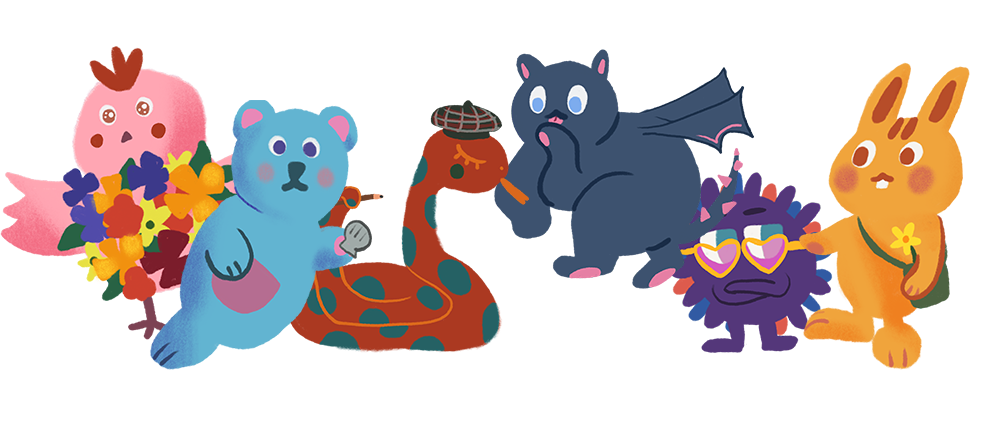

### Grow Your Monster!

🔔그림을 누르면 [링크](https://joomal.github.io/grow-ur-monster/)로 이동합니다🔔

Dain-Kim님의 깃허브 레포 [10-things-test](https://github.com/dev-dain/10-things-test)를 기반으로 만들어진 토이프로젝트입니다.

몬스터를 입양받아와 간식을 주고 산책을 시켜주고 잠자리에서 동화책을 읽어주는 등, 10가지의 상황 별 사용자의 선택지에 따라 다른 몬스터로 변화합니다.  
`호기심 아토`, `힙스터 밤또`, `담요 속의 뱌미`, `반짝반짝 플리`, `송곳니 멍디`, `오매불망 블시`로 총 6종류의 몬스터가 결과값으로 나타납니다.

💎 글/그림 작가 : [ha_ddo](https://www.instagram.com/seohachoi/)  
💻 개발 : [Joomal](https://github.com/JooMal)  
▶️ 개발환경 : html/css, javascript, Atom Editor  
▶️ 작업시간 : 6시간

---
### 내가 배운 것
🔶 타인의 git repository에서 html/css, js 프로젝트를 fork하여 로컬에서 수정하는 법  
🔶 Notion에서의 협업  
🔶 반응형 웹의 기본 작동방식  
🔶 html/css, js 프로젝트를 깃 페이지에 띄우는 법  
