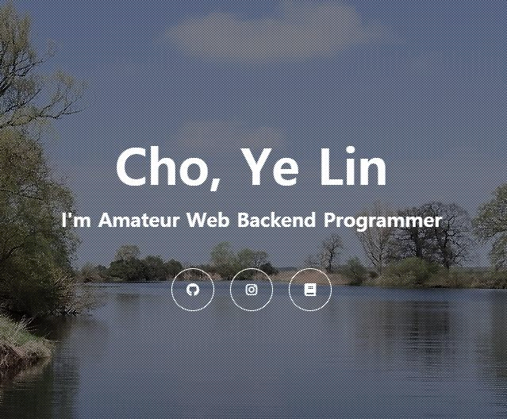

## Simple Webpage

🔔 캡쳐를 누르면 [링크](https://joomal.github.io/html-css-testing/)로 이동합니다 🔔

Inflearn의 [만들면서 배우는 HTML/CSS](https://www.inflearn.com/course/html-css-sucademy)를 수강하며 만든 웹페이지입니다.

💻개발 : [Joomal](https://github.com/JooMal)  
▶️개발환경 : html/css, Brackets Editor  
`BxSlider` 플러그인을 사용하여 배경 이미지가 자동으로 넘어가게 하였습니다.  
`Font Awesome` 플러그인을 사용하여 SNS 아이콘을 삽입하고, 제 SNS 계정들과 각각 연결하였습니다.

---

### 내가 배운 것
🔶 html과 css가 연결되어 작동하는 방식  
🔶 html/css에서 플러그인을 사용하는 방법  
🔶 배경을 꽉 차게 설정하는 법, z-index를 수정하여 이미지들이 겹치게 하는 법 등 간단한 프론트엔드 지식  
