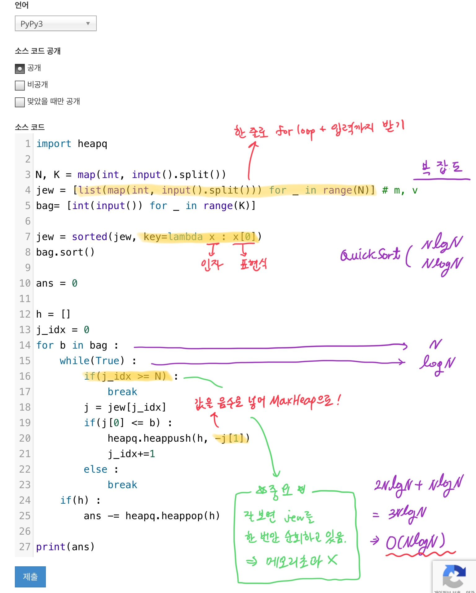

[문제 링크](https://www.acmicpc.net/problem/1202)  
1. <a href="#solve">풀이</a>  
2. <a href="#code">코드</a>  

---

<a name="solve"></a>
## 풀이

</img>

시간초과와 메모리초과로 굉장히 애를 먹었던 문제입니다. 파이썬이 익숙해지면 이런 문제들도 쉽고 빠르게 풀 수 있겠죠?  

### 시간초과 해결

(1) `input`을 `sys.stdin.readline`으로 수정했습니다.  
(2) `Python`으로 돌리던 코드를 `PyPy3`으로 수정해보세요! 조금 더 빨라집니다.  
(3) 2중 for loop을 제거하고 **한 번만** 보석 배열을 순회하게 했습니다. 시간복잡도를 생각해볼까요? N, K 모두 최대 300,000까지 들어오므로 편의를 위해 N과 K를 묶어서 N이라고 생각해보겠습니다. 대략 10^8의 연산을 처리하는 데에 1초가 소모됩니다. 해당 문제의 시간제한은 1초였고, 2중 for loop을 돌게 되면 O(N^2)이며, N은 3(10^5)이므로 N^2은 9(10^10)이 됩니다. 대략 10^11 정도 되겠네요. 이는 분명히 1초 내에는 처리할 수 없는 수입니다. 아마 100,000이 아니라 애매하게 300,000으로 설정하신 것도 **반드시 NlogN으로** 풀게끔 하려는 의도인 듯 합니다.  

### 메모리초과 해결

(1) heapq에 들어가던 **중복**을 없앴습니다. 한 번만 보석 배열을 순회하게 하면서, 직전 가방에서 탐색이 끝난 곳부터 다시 순회하게 바꾸어주었습니다. 어떻게 이게 가능한걸까요? 가방 배열을 **무게 오름차순**으로 정렬한 까닭입니다. 최대 중량 2인 가방이 담을 수 있던 비싼 보석들은, 당연히 최대 중량 10인 가방도 담을 수 있으니 새롭게 heap에 넣어줄 필요가 없습니다.  

<a name="code"></a>
## 코드

```python
import heapq

N, K = map(int, input().split())
jew = [list(map(int, input().split())) for _ in range(N)] # m, v
bag= [int(input()) for _ in range(K)]

jew = sorted(jew, key=lambda x : x[0])
bag.sort()

ans = 0

h = []
j_idx = 0
for b in bag :
    while(True) :
        if(j_idx >= N) :
            break
        j = jew[j_idx]
        if(j[0] <= b) :
            heapq.heappush(h, -j[1])
            j_idx+=1
        else :
            break
    if(h) :
        ans -= heapq.heappop(h)

print(ans)
```
