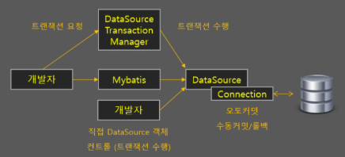
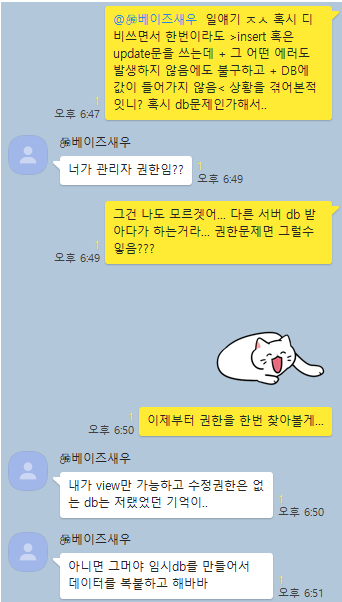
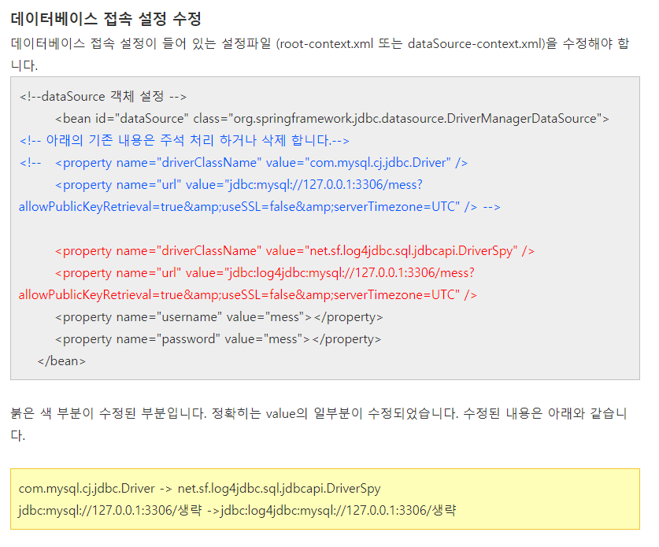

### The resource is not on the build path of a java project

원인 : build path에 Source Folder 지정하지 않아서

해결 : 지난 번에 clone해온 프로젝트 폴더의 빌드 패스 설정이 남아있는 것을 발견하여, 해당 내역 전체 삭제하고 다시 클론해온 프로젝트 설정을 넣어주었습니다.


### mybatis 설정과 로그인 연동하기 (inserNewMember작동안함)


#### No qualifying bean of type '...MemberVO'

당연히 VO는 빈이 아니니까 해당 에러가 났다. DAO를 받아와서 넣어주었다.


### 마이바티스로 매핑은 했는데 DB로 넘어가질 않는다

```
<insert id="insertNewMember" parameterType="memberVO">
	<![CDATA[
			INSERT INTO MEMBERS(MEMBER_ID, MEMBER_PW, MEMBER_NAME, MEMBER_ADRS, MEMBER_EMAIL, MEMBER_PHONE, MEMBER_GRADE)
			VALUES(#{member_id},#{member_pw},#{member_name},#{member_adrs},#{member_email},#{member_phone},#{grade})
		]]>
	</insert>
```

위의 코드가 동작하지 않음

resultMap 자체는 제대로 되었었고(테스트 코드로 확인함), VALUES로 저렇게 넘어가는게 맞을까?

일단 insert test는 추후에 **트랜잭션 어노테이션**을 넣어서 인서트 후엔 꼭 롤백시켜주자.


### 해결해보기 위해 다른 테스트를 작성해보았다.

```java
	@Test
	public void findByIdTest() {
		System.out.println("findbyid test start");
		String id = "admin";
		memlistForTest = memberDao.findById(id);

		for (MemberVO mem : memlistForTest) {
			System.out.println(mem.toString());
		}
		System.out.println("findbyid test end");
	}
```

흔하디 흔한 findById를 작성해서,


```java
	@Override
	public List<MemberVO> findById(String id) {
		sqlMapper = getInstance();
		SqlSession session = sqlMapper.openSession();
		List<MemberVO> memlist = null;
		memlist = session.selectList("mapper.member.findById", id);
		return memlist;
	}
```

DAO 구현체에 메소드를 넣고,


```java
	<select id="findById" parameterType="String" resultMap="memResult">
		<![CDATA[
			SELECT * FROM MEMBERS
			WHERE MEMBER_ID = #{member_id}
		]]>
	</select>
```

마이바티스 매핑을 담당하는 xml 파일에 SQL문을 넣어주었다.

결과는 실패... 동일한 에러가 해당 테스트에서도 발생한다.


다른건 다 차치하더라도, findById 자체를 받아오지 못하고 있는 상황이 이해가 안된다. 도대체 왜..? select all member list는 잘 받아오면서 findById는 대체 왜 안된단말인가? 다른 것은 **파라미터값이 있다는 것**정도 뿐인데.. 파라미터값이 일치하지 않아서 못받고 있다던가?


---


### dao인 insertNewMember가 작동하지 않음


```java
	@Override
	public void insertNewMember(MemberVO memberVO) throws Exception {
		// TODO Auto-generated method stub
		sqlMapper = getInstance();
		SqlSession session = sqlMapper.openSession();
		session.insert("mapper.member.insertNewMember",memberVO);
		session.close();
	}
```


문제가 되는 부분 : 오류 없이 돌아가는데, DB에 넣어지지 않는다.

#### 테스트 방법

memberJoinTest를 작성 :

1.  memberVO에 직접 값을 주입해준 후 dao에서 해당 vo를 파라미터로 직접 insertNewMember를 해주었다.
2. 이후 DB에서 모든 값을 가져와 List를 출력해준다.

결과 :

컴파일 에러 없이 작동되나, 정작 데이터베이스에는 아무 값도 들어가지 않았다.


이미 존재하는 데이터를 넣으려고 시도해보기 :

	1. 데이터베이스에 직접 값을 넣어주고,
 	2. 해당 값과 같은 값을 vo에 넣어 insertNewMember해주었다.
 	3. 이후 DB에서 모든 값을 가져와 List를 출력해준다.

결과 :

**Duplicate entry 'test01' for key 'MEMBERS.PRIMARY'** 에러 발생하였다. 즉 데이터베이스에 접근해서, 직접 넣으려는 시도를 하고 있음에도 불구하고 (=넣으려고 했더니 중복 값이 발생)

중복하지 않는 값을 직접 넣을 때에는 데이터베이스에 반영이 되지 않고 있다.


### 지옥의 구글링

[DB에 insert 실패가 나옵니다](https://okky.kr/article/210928)

> 개발서버는 인서트가 잘 되신다고 하셨는데 
> 실서버는 아예 인서트가 안되는것가요 아니면 될때도 있고 안될때도 있는 것인지요 
> 그것도 아니면 데이터는 들어가는데 이상한 값이 들어가거나 잘려서 들어간다는 얘긴가요? 
> 업데이트는 되나요? 오로지 인서트만 문제가 되는건지요 
> 그런 것을 명확히 해주셔야 원하는 답을 얻을 수 있을 것입니다. 
> 그리고 **인서트와 업데이트시 트랜잭션 처리를 확실히 하셨는지도 궁금**하네요. 
> 무슨 프로젝트신지는 모르겠으나 개발서버는 입출력이나 동시다발성이 거의 없다고 보지만 
> 실서버는 환경이 다를 수 있으므로 로드가 걸리면 과도한 스크립트나 이벤트 순서등에 의해
> 영향을 받을 수 있으니깐요. 단순 하드웨어 문제는 아닌 것 같은데 
> 개발서버와 실서버간 환경 차이에 따른 문제 그리고 콘피그나 설정 문제등은 아닌지
> 다시 한번 확인해보시는게 좋을 것 같습니다.




- insert와 update 시 트랜잭션 처리를 확실하게..? 무슨 말인지 찾아보자.


#### insert와 update시 트랜잭션 처리

[mybatis-spring 트랜잭션](https://codevang.tistory.com/264?category=849481)

마이바티스에서 트랜잭션 기능을 지원하지 않으므로 스프링의 힘을 빌려야 한다. 트랜잭션을 관리해주는 스프링의 클래스는 **DataSourceTransactionManager**이다.

`@Transactional` 어노테이션을 사용하여 처리해줄 수 있다. 정상적으로 수행이 완료되면 커밋을 하고, 예외가 발생할 경우 롤백을 시켜준다.

그럼 Transaction 처리가 되지 않고 있어서, 예외발생여부를 알지 못하는 중인걸까? 한 번 넣어보자. 

1. DataSourceTransactionManager 클래스를 Bean으로 등록 : DB 리소스 관련이므로 루트 컨테이너가 참조하는 xml 파일에 설정해준다. 나는 그냥 root-context.xml에 넣어주었다. (거기에 모든 빈이 다 들어있다;;;

```java
	<!-- 트랜젝션 관리 객체 -->
	<bean id="transactionManager"
		class="org.springframework.jdbc.datasource.DataSourceTransactionManager">
		<property name="dataSource" ref="dataSource" />
	</bean>
```

2. 트랜잭션 어노테이션 찾기 설정 추가

```java
<!-- @Transactional 어노테이션 처리 -->
	<tx:annotation-driven transaction-manager="transactionManager" />
```

이걸 추가하니 tx가 없다고 나온다. 현재 xml 파일 위쪽의 네임스페이스 설정하던 부분에

```java
xmlns:tx="http://www.springframework.org/schema/tx"
```

를 추가해준다.

이걸 해줌으로서 이제 `@Transactional` 어노테이션이 주어진 메소드들은, 스프링의 transactionManager가 주워담아서 갖고 있다가 처리를 해준다.

와!! 이번엔 다음과 같은 에러가 tx:annotation-driven 라인에 발생한다. **The matching wildcard is strict, but no declaration can be found for element 'tx:annotation-driven'**

[참고한 스택오버플로우](https://stackoverflow.com/questions/6058037/the-matching-wildcard-is-strict-but-no-declaration-can-be-found-for-element-tx) 를 보면 내 상황과 굉장히 흡사하다. 자세히 살펴보니 저 사람은 annotation-driven인데 annotation.driven이라고 써두었다. 난 오타 없는데.. 일단 xsi:schemaLocation을 넣어주었다. 살펴보고 tx랑.. 곁들여서 없던 것들을 일단 넣어보았다. 프로젝트 하면서 쓸 것 같아서 일단 넣어둔다.

```java
xsi:schemaLocation="http://www.springframework.org/schema/beans 
  http://www.springframework.org/schema/beans/spring-beans-2.5.xsd
  http://www.springframework.org/schema/aop 
  http://www.springframework.org/schema/aop/spring-aop-2.5.xsd
  http://www.springframework.org/schema/context 
  http://www.springframework.org/schema/context/spring-context-2.5.xsd
  http://www.springframework.org/schema/tx 
  http://www.springframework.org/schema/tx/spring-tx-2.5.xsd"
```

**xsi:schemaLocation**에 추가해주니 마법처럼 'tx:annotation-driven'을 찾을 수 없다던 에러가 사라진다. 이제 테스트를 다시 진행해보자. 

3. 트랜잭션 어노테이션 붙여주기

```java
	@Transactional
	public void insertNewMember(MemberVO memberVO) {
		// TODO Auto-generated method stub
		sqlMapper = getInstance();
		SqlSession session = sqlMapper.openSession();
		session.insert("mapper.member.insertNewMember", memberVO);
		session.close();
	}
```

맨 위에 귀엽게 Transactional이 붙었다. 테스트를 돌리기 전에 잠시 내가 원하는 바를 생각해본다. 정상이면 적용되고, 익센셥이 터지면 적용되지 않는 어노테이션을 추가해준거고, 내가 원하는건 마법같은 스프링의 힘으로 왜 테스트케이스에서 DB 적용이 되지 않았는지를 찾을 수 있는 에러 메세지다. 과연 그렇게 나올까?

결과 : 아무것도 안뜨고 DB에 적용도 안된다.

다음 해결책을 생각해보자. 아까 찾았던 [DB에 insert 실패가 나옵니다](https://okky.kr/article/210928)에서는 이런 답변도 있다.

> 저도 기분상/경험상 추측하기엔..
>
> 몽달님이 말씀하신
>
> \1. 개발 DB 와 상용 DB의 해당 테이블의 스키마가 일치하는지 확인
>
> 이 조치가 해법일 가능성이 돋!!!나게 높을거 같은 느낌입니다;;ㅋ

근데 나는 DB를 하나만 쓰고 있는데.. 그리고 select도 되고 insert를 시도하면 중복이 존재한다는 것까지 익셉션이 되는데 왜 DB에만 정확히 insert가 안된다는 말인가?


### 다시 원인을 찾아보자


우선 이틀째 해당 상황을 해결하지 못하고 있으므로... 그림판으로 상황을 요약해서 내 머릿속도 한 번 정리해보았다. 



DB를 많이 다뤄본 통계학 척척석사한테 물어보니 저런 답을 얻었다. admin으로 하고 있다보니 당연히 권한은 관리자권한이리라 생각했었는데, jdbc로 받아와서 하는건 조금 다를 수 있겠다. (local로 할 때는 엄청 잘 됐었는데... 뭔가 aws DB를 사용하기 위해서는 특정 메소드로 권한 설정을 해주어야 한다던가?)

우선 AWS DB 서버 자체를 다른 팀원분이 열어주신 상태였기 때문에, 정말 권한문제가 맞는지를 알아보고자 **Logger**를 사용해보기로 결정했다.


### slf4j

찾아보니 현재 프로젝트에선 slf4j를 사용하고 있어서, 이를 이용해 로그를 찍어보려 한다. (log4j를 이미 쓰고있다고 생각해서 다짜고짜 Logger를 썼더니 이클립스가 slf4j만 임포트하려고 해서..)


slf4j는 Facade Pattern이라고 한다. 정보처리기사를 공부할 때 희미하게 스쳐지나갔던 기억이 난다. 공통된 인터페이스를 갖고, 내부적으로 적절하게 구현체를 변환해서 사용하는게 파사드패턴이라고 한다. 아주 아름다운 SOLID... 

응? 근데 다시 입력하니 기억대로 log4j를 이미 사용하고 있었다. import 추천(?)을 제대로 못읽었던 듯.. 어차피 slf4j에서 log4j를 구현체로 받아와서 사용하는 모양이니, 그냥 log4j를 예정대로 사용하기로 했다.

### log4j

[참고중인 페이지](https://androphil.tistory.com/420)

사용을 위해선 pom.xml에서 log4j의 scope를 주석처리해준다. 원래 runtime으로 scope이 한정되어 있었기 때문이다.

```xml
<dependency>
			<groupId>log4j</groupId>
			<artifactId>log4j</artifactId>
			<version>1.2.15</version>
			<exclusions>
				<exclusion>
					<groupId>javax.mail</groupId>
					<artifactId>mail</artifactId>
				</exclusion>
				<exclusion>
					<groupId>javax.jms</groupId>
					<artifactId>jms</artifactId>
				</exclusion>
				<exclusion>
					<groupId>com.sun.jdmk</groupId>
					<artifactId>jmxtools</artifactId>
				</exclusion>
				<exclusion>
					<groupId>com.sun.jmx</groupId>
					<artifactId>jmxri</artifactId>
				</exclusion>
			</exclusions>
			<!-- <scope>runtime</scope>  -->
		</dependency>
```

(그나저나 typora의 코드문법 하이라이터(?)에서 xml이 지원되는건 또 처음 알았다.)

이제 데이터베이스와 log4j가 뭔가 연동을 해서(?) SQL에 에러가 발생하거나 등등을 찍어주도록 해준다.

[어떻게 연동하나요](https://freehoon.tistory.com/113)를 따라서 해보려고 하는데, 당황스러운 부분을 마주하게 된다.



이렇게 되면 jdbc driver는 어떻게 되는거지...? dataSource 자체를 바꾸어줘도 되는건가? ㅠㅠ

일단은 해당 내용을 접고 다시 연동을 살펴보기로 했다.

### 로컬 DB를 만들어서 연동되는지 살펴보기

- 의심 포인트 : 읽기 권한만 받아온 경우에는 select는 돌아가고 insert는 에러없이 동작하되 DB 반영이 안된다고 한다고 하니까,
- 해결책 : 로컬 DB에서는 insert가 되면 DB 서버권한문제고, insert가 안되면 코드문제일 것이다.

mysql 로컬 서버에 testdb 데이터베이스를 만들어서 연동해보니, 동일한 오류가 발생한다. 차라리 다행이다! DB 서버 문제가 아니라 코드 문제인 걸 알게되어서..

> 아무튼 결과는 실패. 코드 문제라는 걸 알게되었다.


### parameterType대신 parameterMap이라던가?

- 근데 이게 틀렸다면 parameterType으로 돌린 코드에서는 에러가 나지 않았을까?
- 왜 컴파일에러, 런타임에러에서 잡히질 않았을까? 이 점에 대해서는 스프링에서 발생시켜주는 에러를 공부해야겠다.

```java
	<insert id="insertNewMember" parameterMap="memberVO">
		<![CDATA[
			INSERT INTO MEMBERS (MEMBER_ID, MEMBER_PW, MEMBER_NAME, MEMBER_ADRS,
			MEMBER_EMAIL, MEMBER_PHONE, MEMBER_GRADE) 
			VALUES( #{member_id}, #{member_pw}, #{member_name}, #{member_adrs},
			#{member_email},#{member_phone},#{grade} )
		]]>
	</insert>
```

parameterType 대신 parameterMap으로 사용해본다. 

```java
### Error updating database.  Cause: org.apache.ibatis.builder.IncompleteElementException: Could not find parameter map mapper.member.memberVO
```

차라리 익센셥이 발생하니 마음이 편하다.

1. 왜 ibatis로 에러가 나는걸까? parameterMap은 ibatis꺼라는걸 알고 있었지만, 현재 사용중인 mybatis에서 **parameterMap이 없다**는 식의 에러가 발생할 거라고 생각했다. mybatis가 아니라 ibatis로 사용되고 있었다던가?


#### 우선 parameterMap에 대해 알아보자

JDBC PreparedStatement의 값 토큰과 매치되는 정렬된 파라미터 목록을 명시해야한다. 설정 xml 파일을 쭉 읽어내려가다가 ,

```xml
<?xml version="1.0" encoding="utf-8"?>
<!DOCTYPE sqlMap PUBLIC "-//iBATIS.com//DTD SQL Map 2.0//EN"
    "http://www.ibatis.com/dtd/sql-map-2.dtd">
    
<sqlMap namespace="Product">

    <parameterMap id="insert-product-param" class="com.domain.Product">
       <parameter property="id">
       <parameter property="description">
    </parameterMap>
    
    <statement id="statementName" parameterMap="insert-product-param">
       insert into PRODUCT (PRD_ID, PRD_DESCRIPTION) values(?, ?);
    </statement>

</sqlMap>

출처: https://hyeonstorage.tistory.com/282 [개발이 하고 싶어요]
```

위 형태의 parameterMap id 선언과 property를 받으면 저장해두었다가 매핑해주는 동작인 것 같다. 그렇다면 해당 선언이 없는 상황에서는 당연히 못쓴다!

