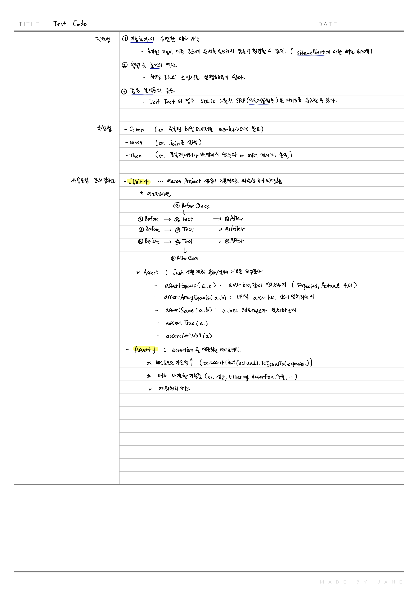

# 필요성

1. **기능 추가 시** 유연한 대처 가능 : 추가된 기능이 다른 코드에 문제를 일으키지 않는지 확인할 수 있다. (side-effect에 대한 빠른 피드백 가능)
2. 협업 중 **문서**의 역할 : 해당 코드의 쓰임새를 다른 팀원들에게 설명해주기 쉽고, 다른 팀원들이 코드의 역할과 사용법을 빠르게 파악할 수 있다.
3. **좋은 설계**로의 유도 : 단위 테스트에 해당되는 내용. SOLID 중 1원칙인 SRP(Single-Responsibility-Principle;단일책임원칙)을 지키게끔 유도할 수 있다. 

# 작성법

Given-When-Then이 반드시 정답은 아니지만, 테스트 코드 입문자들에게 많이 추천되는 작성법이다.

- Given : 주어진 상황. (ex. 중복된 회원 데이터를 memberVO에 받고)
- When : 실행 (ex. memberJoin을 실행하면)
- Then : 결과 (ex. 중복 데이터가 반영되지 않아, 이전과 이후의 DB 데이터 수 변화가 없다 or 에러 메세지가 송출된다)

# 현재 사용중인 프레임워크

## JUnit4

- 왜 JUnit5를 안썼는가? : Maven Project 생성지 기본적으로 JUnit4 의존성이 추가되어 있어, 해당 프레임워크를 사용함. 필요할 경우 추후 Junit5를 추가할 예정이다.

### 어노테이션

@BeforeClass

@Before : 테스트 메소드 이전에 실행할 메소드 (ex. 초기화)

@Test : 테스트 메소드

@After : 테스트 메소드 이후에 실행할 메소드 (ex. DB 반영 내역 지우기 등 트랜잭션 처리?)

@AfterClass

### Assert

: junit 실행 결과로서 통과, 실패 여부를 띄워줌

- assertEquals(Expected, Actual) : a와 b의 값이 일치하는지
- assertArrayEquals(Expected, Actual)
- assertSame(Expected, Actual) : a와 b의 레퍼런스가 일치하는지 (레퍼런스도 일치하고 값도 일치하는 완전히 동일한 객체여야함)
- assertTrue(a)
- assertNotNull(a)

## AssertJ

: assertion을 제공해주는 라이브러리

### 왜 쓰는가?

- 테스트 코드 가독성이 올라감. 가령 assertEquals의 Expected, Actual의 순서가 헷갈리는데, AssertJ를 사용하면 `assertThat(actual).isEqualTo(expected)` 로 흐름대로 읽어진다.
- 여러 다양한 기능들 제공 (ex. 검증, Filtering Assertion, 추출, ...)
- 예외처리 체크 가능

