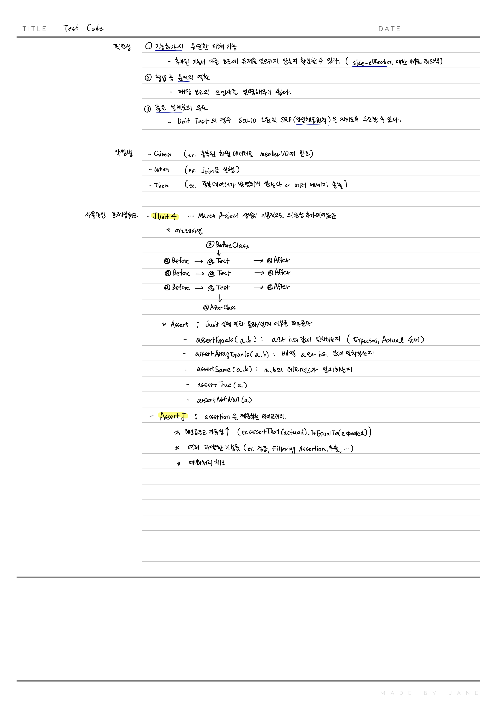

# TIL

## Github

- 깃허브 메인 페이지(리드미) 배지 추가 : Stack에 들어가는 다양한 배지들을 추가했습니다.

## 생산성

- Test Code에 대한 공부

  

### 오늘의 생각

- Docker를 공부해야겠다. : 유투브에서 도커를 소개해주는 컨텐츠를 두 개 정도 보았고, 이미지라는 형식으로 환경설정과 여러 프로그램의 연결(?)을 저장해서 어느 서버든 옮겨다닐 수 있게 되어있음 -> 프로젝트 코드 역시 아주 작은 CentOS 서버에 올렸다가, 추후 큰 서버로 옮길 예정이니 도커를 사용하는게 맞겠다.