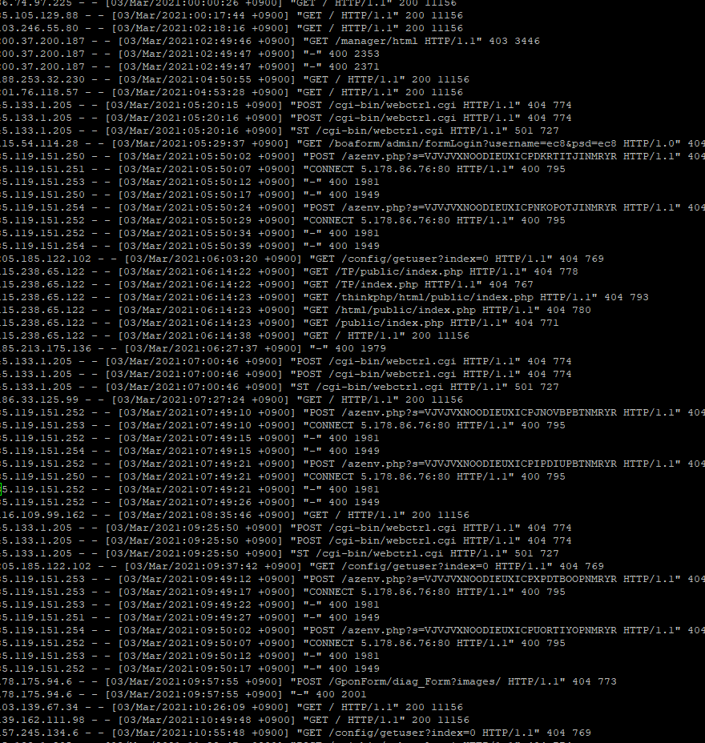

# 서버 배포하기

우선적으로 join만 만들어진 rest api 프로젝트들을 웹서버에 올려보기로했다. (그래야 프론트엔드 쪽에서도 이게 돌아가는지 아닌지를 확인할 수 있으니까)

상황 : WAR 파일을 파일질라를 이용해 tomcat 폴더에 넣었는데 실행이 안된다. 아무것도.

### 시도1

당시 톰캣이 안되어서 과거의 내가 여러개를 깔았을 가능성도  있다. 그렇다면 내가 war파일을 넣은 톰캣 폴더는 짭이다.

해결1 : 그럼 index를 넣어보고 홈 출력이 되는지를 한번 봐보자. 그럼 짭톰캣인지 아닌지 알 수 있을것이다.

	- examples를 보니까 index가 있는데 {ip주소}/examples/index.html로 출력해도 아무것도 안나온다.
	- 그럼 짭인것같기도 하고.. var/log/tomcat에서 한번 봐볼까? tomcat이 없는데..?

해결2 : 그럼 톰캣 서버를 그냥 셧다운하고 8080을 붙이면 잘 돌아가는지 보자.

- 껐더니(shutdown.sh) 안돌아간다. 이 폴더가 맞긴 하구나.

근데 아까는 못찾았던 log를 여기서 찾았다 ㅎㅎ;

나는 잘 못하고있지만 우리 센토스는 열심히 일하고 있었구나.. 뭔가 복잡하게 GET POST 등등을 왔다갔다 주고받고 있다. 보면 "GET ..." 뒤에 403, 400, 200 등등 뜨는게 http 그 에러 404 이럴 때 뜨는 응답번호같다. 응답번호라고 불렀던게 맞는지 긴가민가하지만.. 아무튼 센토스가 일하는 모습을 보니 참 기특하다

### 시도2

var/www에 깔아볼까? 안되면 지우면 되니까. (넣는거로 인해 문제는 생기지 않으리라 생각한다)

- 지금 새로 메이븐 빌드해서 깔아보았다
- 다시 서버 껐다키고
- {ip}/member로 시도해보자

결과 : 안됨

### 시도3

[이 글](https://okky.kr/article/385723)을 읽으니 혹시 server.xml 세팅 문제일까 싶다. 물론 세팅을 하지 않았으니까 모든 곳에 문제가 있을 수 있긴 하다. (이래서 구글링이 아니라 책이나 강의에서 보고 따라해야하는 듯... 내가 보고 한 곳에서는 설정을 따로 안해줬었는데, 아마 그 사람은 이전에 설정을 한 모양이다.)

- 설정을 바꾸어서 war파일로 만들었다. 
- `[WARNING] The requested profile "pom.xml" could not be activated because it does not exist.` 경고가 매번 빌드때마다 뜨는데, 이게 정상인지 아닌지를 모르겠다. 이번에도 안되면 해당 부분을 고쳐볼 예정 (근데 finalName으로 war파일 이름을 설정해준 것은 또 제대로 적용이 되었다;)

### 이젠 WAR 파일 압축 해제까지 안되는 상황이 발생..

분명 자동으로 war 파일이 해제되도록 해두었는데, 어제 만들어두었던 war파일을 그대로 가져와서 시험삼아 한 번 돌리니... 되질 않고 있다. 이게 대체 무슨일..

혹시 bbbbff로 war 최종 파일 이름을 바꾸어서 그런가 싶어 멤버로 다시 시도해본다.

- 결과 : **실패**

아니 왜..? 대체 내가 무엇을 건드렸단 말인가? 이쯤되면 초기화를 다 하고 싶은 마음이 들기까지한다. 로그를 보니 이런 에러가 나고 있었다.

`org.apache.catalina.core.ContainerBase.startInternal A child container failed during start`

네..? [이 질의응답 게시글](https://www.inflearn.com/questions/5283)을 보니 맥에서는 발생하지 않고, 윈도우즈에서만 발생하는 문제라고 한다. 그렇다. 지난번에 docBase가 docBast라고 이상하게 적혀있는 것을 발견하고, docBase로 바꾸어주었던 기억이 있다. 그렇다면 해당 오타가 교정되면서 서버가 정상 작동에 실패하게 된거니, 이 문제를 고치면 모든것이 잘 돌아가지 않을까?

