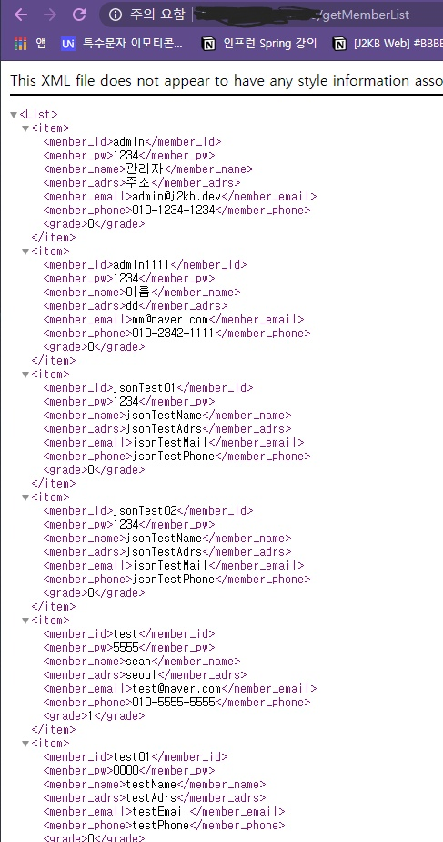

# 서버 배포하기

우선적으로 join만 만들어진 rest api 프로젝트들을 웹서버에 올려보기로했다. (그래야 프론트엔드 쪽에서도 이게 돌아가는지 아닌지를 확인할 수 있으니까)

상황 : WAR 파일을 파일질라를 이용해 tomcat 폴더에 넣었는데 실행이 안된다. 아무것도.

### 시도1

당시 톰캣이 안되어서 과거의 내가 여러개를 깔았을 가능성도  있다. 그렇다면 내가 war파일을 넣은 톰캣 폴더는 짭이다.

해결1 : 그럼 index를 넣어보고 홈 출력이 되는지를 한번 봐보자. 그럼 짭톰캣인지 아닌지 알 수 있을것이다.

	- examples를 보니까 index가 있는데 {ip주소}/examples/index.html로 출력해도 아무것도 안나온다.
	- 그럼 짭인것같기도 하고.. var/log/tomcat에서 한번 봐볼까? tomcat이 없는데..?

해결2 : 그럼 톰캣 서버를 그냥 셧다운하고 8080을 붙이면 잘 돌아가는지 보자.

- 껐더니(shutdown.sh) 안돌아간다. 이 폴더가 맞긴 하구나.

근데 아까는 못찾았던 log를 여기서 찾았다 ㅎㅎ;

나는 잘 못하고있지만 우리 센토스는 열심히 일하고 있었구나.. 뭔가 복잡하게 GET POST 등등을 왔다갔다 주고받고 있다. 보면 "GET ..." 뒤에 403, 400, 200 등등 뜨는게 http 그 에러 404 이럴 때 뜨는 응답번호같다. 응답번호라고 불렀던게 맞는지 긴가민가하지만.. 아무튼 센토스가 일하는 모습을 보니 참 기특하다

### 시도2

var/www에 깔아볼까? 안되면 지우면 되니까. (넣는거로 인해 문제는 생기지 않으리라 생각한다)

- 지금 새로 메이븐 빌드해서 깔아보았다
- 다시 서버 껐다키고
- {ip}/member로 시도해보자

결과 : 안됨

### 시도3

[이 글](https://okky.kr/article/385723)을 읽으니 혹시 server.xml 세팅 문제일까 싶다. 물론 세팅을 하지 않았으니까 모든 곳에 문제가 있을 수 있긴 하다. (이래서 구글링이 아니라 책이나 강의에서 보고 따라해야하는 듯... 내가 보고 한 곳에서는 설정을 따로 안해줬었는데, 아마 그 사람은 이전에 설정을 한 모양이다.)

- 설정을 바꾸어서 war파일로 만들었다. 
- `[WARNING] The requested profile "pom.xml" could not be activated because it does not exist.` 경고가 매번 빌드때마다 뜨는데, 이게 정상인지 아닌지를 모르겠다. 이번에도 안되면 해당 부분을 고쳐볼 예정 (근데 finalName으로 war파일 이름을 설정해준 것은 또 제대로 적용이 되었다;)

### 이젠 WAR 파일 압축 해제까지 안되는 상황이 발생..

분명 자동으로 war 파일이 해제되도록 해두었는데, 어제 만들어두었던 war파일을 그대로 가져와서 시험삼아 한 번 돌리니... 되질 않고 있다. 이게 대체 무슨일..

혹시 bbbbff로 war 최종 파일 이름을 바꾸어서 그런가 싶어 멤버로 다시 시도해본다.

- 결과 : **실패**

아니 왜..? 대체 내가 무엇을 건드렸단 말인가? 이쯤되면 초기화를 다 하고 싶은 마음이 들기까지한다. 로그를 보니 이런 에러가 나고 있었다.

`org.apache.catalina.core.ContainerBase.startInternal A child container failed during start`

네..? [이 질의응답 게시글](https://www.inflearn.com/questions/5283)을 보니 맥에서는 발생하지 않고, 윈도우즈에서만 발생하는 문제라고 한다. 그렇다. 지난번에 docBase가 docBast라고 이상하게 적혀있는 것을 발견하고, docBase로 바꾸어주었던 기억이 있다. 그렇다면 해당 오타가 교정되면서 서버가 정상 작동에 실패하게 된거니, 이 문제를 고치면 모든것이 잘 돌아가지 않을까?

### 결국 지우고 다시 clone

다시 클론해온걸 다시 넣어주니 거짓말처럼 여전히 압축해제가 안된다.

... 그렇게 넋이 나간채로 방치하길 3일...

다시 도전!

### 지난 시간까지의 이야기

서버 배포를 시도했지만 WAR 압축이 어느순간부터 풀리지 않는 사태 발생. 급히 다시 클론을 해왔으나 여전히 압축해제가 안된다. 결국 서버 문제인데..

서버문제라는 확신을 얻고 이제 알아보니

docBase에 해당하는 폴더가 있어야 배포가 되는 경우가 있다. (윈도우즈에서) 그래서 폴더를 만들어주니 마법처럼 압축이 풀린다....

근데 그래도 접속이 안된다. 대체 왜?

docBase를 examples로 접속을 해봐도 안된다. 그럴리가 없는데? 그렇게 한 시간을 또 헤매다가 넋이 나간 상태로`{ip주소}:8080/....` 으로 타이핑을 한다.

# 된다.

기나긴 여정은 이렇게 끝이 난다. docBase를 다시 bbbbff로 옮겨주었다.

결국 정리하자면 다음과 같다.

1. 최초에 docBase가 문제가 있는 상태였음.
2. 그래서 그걸 고침.
3. 문제가 있는걸 고치니까 **정상적으로 에러를 뱉기 시작**한다. 즉 이전까지는 docBase 설정이 잘못된 상태로 그냥 압축이 풀리는 기묘한 상태였다면, docBase를 고치니까 잘못된 상태임을 인지하고 정상적으로 에러를 뱉어낸 것 같다.
4. 기묘하게도 윈도우즈에선 docBase에 해당하는 폴더를 직.접. 만들어줘야 한다. **정상적으로 에러를 뱉기** 전까진 안만들어줘도 잘 압축이 풀렸음...
5. docBase에 해당하는 폴더를 직접 만들어주고 나니까 정상적으로 작동시작함.

정말 이 기묘한 상태를 고치기 위해서 얼마나 긴 시간을 버렸던지.... 하루 일과중에 잠깐씩 하다보니 집중력이 자주 흐트러진 것도 있지만, 합치면 15시간? 18시간 정도는 저걸 고치려고 온갖 짓을 다했다.

내가 시도해본 것 : docBase 고치기 n회, 로그 찾아서 로그 뜯어보기, pom.xml 바꾸기, web.xml 바꾸기, conf 들어가서 server.xml 바꾸기(이건 한 50번은 바꾼것같다).

덕분에 잊고 살던 리눅스의 명령어도 기억해냈다. vi 에디터 쓰는 법도 까먹어서 처음에 vi 에디터 켰을 때에는 어떻게 insert 모드에서 빠져나가는지도 기억이 안났었는데, 이젠 그냥.. `:q!`(vi에디터 저장없이 강제종료) 가 일상...

드디어..

드디어!!!!!!!!!!!!!!!!!!!!!!!!!!!!!!!!!!!!!!!!!!!!!!!!!!!!!!!!!!!!!!!!!!!!!!!

이제 배포 테스트가 잘 되었으니 다시 개발에 전념할 수 있겠다 ㅎㅎ