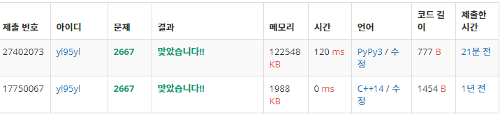

### 문제

과거에 c++로 풀이했었던 [단지번호붙이기](https://www.acmicpc.net/problem/2667) 문제를 파이썬으로 다시 풀어보았습니다. dfs 파이썬 풀이법을 손에 익히고 있는 중인데요. 확실히 c++에 비해 표현력이 좋다는 말이 실감이 납니다. 

### C++과의 비교

c++의 경우에는 dfs는 vector 배열로, bfs는 queue을 사용했습니다. 또한, queue를 사용하는 만큼 풀이법 자체도 미묘하게 달랐었는데요.

python의 경우에는 dfs는 list로, bfs는 deque(list를 사용할 수도 있지만, pop(0)의 시간복잡도가 O(N)이기 때문에, popleft의 시간복잡도가 O(1)이 나오는 deque를 사용)로 풀게 되며, 자료구조만 다를 뿐 풀이가 거의 같아지게 됩니다. 그만큼 풀이 도중 dfs에서 bfs로의 전환이 빠를 것이라 예상이 됩니다.

### 풀이

dfs, bfs 중 손에 익은 어떤 것으로 푸셔도 상관없는 문제입니다. 제 경우에는 지난 풀이 때에 dfs로 풀었었기 때문에, 비교를 위해 dfs로 풀었습니다.

큰 틀은 메인에서

- 모든 노드를 순회하며
- 아직 방문하지 않았으며, 집이 존재하는 노드를 만나면
- 단지 수를 하나 늘리고, 해당 단지의 집 갯수를 1로 할당해준 후, 해당 노드를 시작점으로 dfs를 돕니다.

dfs에서는, 다음과 같은 동작을 합니다.

1. 해당 노드를 방문하였음을 표시하고,
2. 이동 가능한 방향으로 이동하며 dfs를 수행합니다. 이때, 해당 단지의 집 갯수를 1 추가해줍니다. 또한 **이동 가능**의 조건은 다음과 같습니다.
   - 적합한 좌표값일 것 (0 이상이며, N보다 작아야 합니다.)
   - 집이 존재할 것
   - 방문한 적 없을 것

정답 코드는 다음과 같습니다.

### 정답코드 (C++)

```c++
#include <iostream>
#include <vector>
#include <algorithm>
#include <cmath>
#include <bits/stdc++.h>
using namespace std;

#define MAX 25

int MAP[MAX][MAX];
int DANJI[MAX*MAX];

int dir[4][2] = { {-1,0}, {1,0}, {0,-1}, {0,1}  };
int danji_cnt;
int n;
bool visited[MAX][MAX];

bool isInside(int x, int y)
{
	return (x>=0 && x<n) && (y>=0 && y<n);
}

void dfs(int x, int y, int key)
{
	DANJI[key]++;

	visited[x][y] = true;
	MAP[x][y] = key;
	
	for(int i=0;i<4;i++)
	{
		int dx = x + dir[i][0];
		int dy = y + dir[i][1];

		if(isInside(dx, dy) && (MAP[dx][dy] == 1))
		{		
			if(!visited[dx][dy]) dfs(dx, dy, key);
		}
	}
}
void Solution(int n)
{
	danji_cnt=1;
	
	for(int i=0;i<n;i++)
	{
		for(int j=0;j<n;j++)
		{
			if(MAP[i][j]==1)
			{
				if(!visited[i][j]) dfs(i, j, danji_cnt++);
			}
		}
	}
	
}

int main()
{	
	cin >> n;
	for(int i=0;i<n;i++)
	{
		DANJI[i]=0;
	
		for(int j=0;j<n;j++)
		{
			scanf("%1d",&MAP[i][j]);
		}
	}
	
	Solution(n);
	
	danji_cnt--;
	cout << danji_cnt << '\n';
	sort(DANJI, DANJI+danji_cnt+1);
	for(int i=1;i<=danji_cnt;i++)
	{
		cout << DANJI[i] << '\n';
	}
	if(DANJI[1]==0) cout << 0;
	return 0;
}

```

### 정답 코드(Python)

```python
N = int(input())
address = []
danjiCnt = 0
danjiArr = {}
for _ in range(N) :
  address.append(list(map(int, input())))
visited = [[False]*N for _ in range(N)]
dir = [[-1,0],[1,0],[0,-1],[0,1]]

def isValidate(x,y) :
  return x >= 0 and x < N and y >= 0 and y < N

def dfs(x, y) :
  visited[y][x] = True
  for i in range(len(dir)) :
    nextX = x + dir[i][0]
    nextY = y + dir[i][1]
    if(isValidate(nextX, nextY) and address[nextY][nextX]==1 and visited[nextY][nextX]==False) :
      danjiArr[danjiCnt]+=1
      dfs(nextX, nextY)

for y in range(N) :
  for x in range(N) :
    if(visited[y][x]==False and address[y][x]==1) :
      danjiCnt+=1
      danjiArr[danjiCnt]=1
      dfs(x,y)

arr = sorted(list(n for n in danjiArr.values()))
print(len(arr))
for n in arr : print(n)
```

### 메모리, 속도 비교



c++이 확실히 메모리도, 시간도 효율적인 것으로 확인됩니다.

다만 실제 프로그래밍 테스트에선 각 언어에 맞는 시간 제한과 메모리 제한을 따로 두기 때문에, 코드 구현력이 좋고 가독성이 높은 python을 앞으로도 쭉 문제풀이에 사용할 예정입니다. (특히 문자열 파싱이 압도적으로 편하기 때문에...)

1년 전 코드를 다시 보니 안 예쁜 부분도 보이긴 하지만, 함수 이름이나 변수 이름이 대체로 같아서 놀랐습니다. danji를 1년 전에도 danji라고 썼었다니... 조금 민망하네요.

