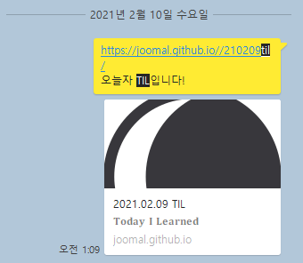

# TIL(Today I Learned) 스터디 오늘모햇지 모집

안녕하세요? TIL 일주일 3회 이상 업로드를 목표로 하는 스터디를 모집합니다.
서로간에 꾸준히 동기부여를 받아 삶의 밀도를 높이고, 기록을 통해 내가 무엇을 해왔는지를 쉽게 인지할 수 있습니다.

1. 작성방식
- TIL은 깃블로그, ve.log, 인스타그램 등 플랫폼을 구분하지 않고 작성 가능
- 일주일에 3번 이상 J2KB 카카오톡에 본인의 TIL을 업로드
- 내용은 반드시 개발 관련된 생산적인 내용이 아니어도 좋습니다. 내용과 형식은 완전히 자유롭게 진행하시면 됩니다. 다음은 TIL로 작성 가능한 내용의 예시입니다.
* (개발, 자격증 등) 공부 정리본을 개인 블로그에 포스팅 후, TIL 내부에서 링크로 공유
* 공부 정리를 TIL에 직접 작성
* 수강한 강의 목록 나열
* 운동, 독서, 산책, 요리 등의 오늘 활동한 내역을 TIL 내부에서 공유

2. 예시
제가 지난 시즌에 작성했던 TIL들 중에 임의로 몇 개를 추려보았습니다.
https://joomal.github.io//210121til/
https://joomal.github.io//210108til/
https://joomal.github.io//210209til/
위처럼 아주 아주 자유로운 형식으로 작성해주시면 됩니다.

3. 규칙
- 벌금이나 패널티는 전혀 없습니다. 그런만큼 자유롭게, 열심히 공부 진행하며 깃허브 채워나가실 분들을 모집합니다! 중도 하차도 얼마든지 가능하나 되도록이면 이번 기수 끝까지 함께 했으면 합니다.
- 일주일에 3번 이상 업로드를 목표로 진행합니다.

4. 진행방식

- TIL 작성 후, J2KB 카카오톡에 본인의 TIL 링크를 업로드

