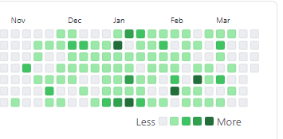
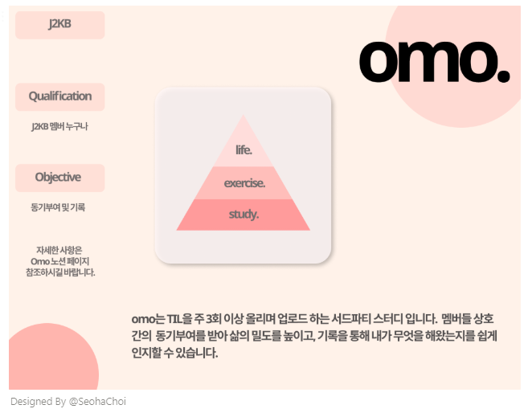

# TIL

근 한 달 만의 TIL입니다. 여러모로 바쁜 일들이 겹치고 TIL을 중단하면서 커밋을 굉장히 못했네요 😂 잔디가 갑자기 밀려버린. TIL을 중단한 이후로 미묘한 괴리감과 무기력함을 쭉 느껴온 까닭에, 다시 시작합니다.

바쁘면 기록물을 내팽겨치곤 하는 까닭에, 아무래도 TIL이라도 하루 20-30분 정도 시간을 내어야 일상 기록이 가능해질 듯 합니다. 게으른 불도저 천성... 

저는 `Atom`대신  `Typora`를 쓰기 시작함에 따라, 이전에 사용했던 포맷을 버리고 자유 양식으로 업로드하게 되었습니다. 이전 포맷이 깔끔하긴 했었는데, `Typora`에선 주석처리가 안되다보니, 카테고리를 넣고 빼는 과정이 복잡하더군요.

## 🎉

### 알고리즘 문제 풀이

개인적으로 참여하고 있는 알고리즘 문제 풀이 스터디에서 두 문제를 풀었습니다.

- 2019 카카오 블라인드 공채 [오픈채팅방](https://programmers.co.kr/learn/courses/30/lessons/42888)
- 2020 카카오 블라인드 공채 [문자열 압축](https://programmers.co.kr/learn/courses/30/lessons/60057)

### 문제 풀이 해설글 업로드

풀이 후 시간이 40분 정도 남아, 코드 리팩토링을 진행하고 알고리즘 풀이 게시글을 업로드하였습니다.

- [오픈채팅방 해설](https://joomal.github.io//210331cp1/)
- [문자열 압축 해설](https://joomal.github.io//210331cp2/)

### 코드리뷰

코드리뷰 스터디를 22:00~23:00 동안 진행했습니다.

## ✨

### TIL 스터디 오늘모했지 개설

혼자 하면 절대 안하고 여럿이 모이면 무조건 하는 기묘한 성격을 기반으로 기어코 스터디를 열었습니다.

스터디 모집 노션 게시글은 [해당 링크](https://www.notion.so/yelin1122/TIL-Today-I-Learned-omo-9093be2d2b59483f97b28660fcbfb71b)에서 확인할 수 있습니다.

# ☹ 지나간 일들

TIL을 작성하지 않은 동안 굉장히 많은 일들이 있었습니다.

### 라인 코딩테스트

알고리즘 4문제 중 3문제 솔, 구현+리더빌리티 3문제 중 2문제 솔 했었습니다. 리더빌리티 문제를 올솔 못한게 마음에 많이 걸렸었지만, 내심 그래도 왠만하면 면접에 가겠다는 생각에 기뻤습니다만... **탈락**했습니다 ㅎㅎ

자소설 채팅창 확인 결과 커트는 알고리즘 3/4 리더빌리티 올솔로 추정됩니다. 속상해서 몇 일을 넋놓았었고 지금도 내심 속상하긴 한데, 그래도 뭐... 속상해도 공부는 해야하니깐... 

리더빌리티를 신경쓰느라 메소드를 과하게 분리하고, 예쁜 코드를 작성하려고 머리를 싸매느라 작업 속도가 너무 더뎠던 것이 문제같습니다. 다음엔 제발 솔부터 받고... 리더빌리티 신경쓰는 걸로...

### 운영체제 공부 진행중

면접이다! 라는 생각에 머리 싸매고 운영체제를 복습 중이었습니다. 라인 불합을 받고 맥이 빠지면서 요 몇일 공부를 안했었는데 다시 정신 차리고 해야겠습니다.

- 네트워크 전공 서적도 찾고 있습니다! 추천 가능하신 분 추천해주시면 감사하겠습니다.

### 손코딩 공부중

엔테크서비스 구글검색,IDE 사용 불가 코딩테스트 전형에서 광탈하고 눈물의 손코딩 공부를 진행하고 있습니다. 개인적으로는 IDE 사용이 안되는 코딩테스트가 이해가 안되긴 하지만... 기업의 뜻에 따라야 돈을 벌 수 있으니 기업의 뜻에 따르겠습니다.

