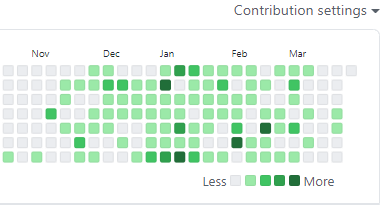

# TIL

11월 중순부터 많이 심어왔던 잔디가 요 몇 주 사이에 잠시 끊겼었습니다. 이제 다시 일일커밋을 목표로 달리는 중입니다!

거의 면접준비와 코딩테스트준비가 대부분이어서, 유의미한 코드 커밋보다는 포스팅 위주가 될 것 같습니다.

## 🎉

### 코딩 테스트

어제는 두 개의 코딩테스트를 보았습니다.

- 카카오커머스 신입 백엔드 개발자
  - 3문제 중 2솔 했습니다. 3솔이 가능했을텐데, 처음 풀었던 방법이 검증되지 않았다고 생각하면서 다시 풀다가 결국 놓쳤습니다. 과한 긴장감이 원인이었던 것 같아, 앞으로는 긴장을 풀어보려고 합니다.
- 프로그래머스 데브매칭
  - 4문제 중 3솔 했습니다. 4솔을 못한게 많이 아쉬웠습니다. 조금만 더 손이 빨랐더라면 쉽게 할 수 있었을텐데, 라는 생각에 앞으로도 열심히 공부하는 계기가 되었습니다.

### 운영체제 공부

- 챕터 7 교착상태(데드락)을 깊게 공부했습니다. 교착상태의 네 가지 조건 상호배제, Hold-and-wait, 비선점, 순환대기와 각 조건 중 하나를 없앰으로서 교착상태를 예방하는 방법, 교착상태를 회피하는 방법(자원이 어떻게 요청될 지에 대한 추가 정보를 프로세스에게 받는다)을 공부했습니다.
- 챕터 8 메모리 관리 기법을 공부하고 있습니다. 분명히 알던 내용임에도 공부를 안하다가 하려니까 잘 기억이 나질 않아 곤혹스러웠습니다. 내부 단편화, 외부 단편화, 페이징, 세그먼테이션에 대해 공부했습니다.

### 자바 공부

- 객체지향 개념이 덜 잡힌 것 같아 자바를 다시 보고 있습니다. 추상화와 인터페이스를 공부했습니다. 한 번 빠르게 훑고 나면 객체지향 관련된 서적을 하나 읽어보아야 할 것 같습니다.

## ✨

- 아르바이트 출근 : 바빴던 만큼 퇴근이 빠르게 다가와서 좋았습니다.
- 빨래
- 쓰레기 버리기

요즘은 타이머를 켜두고 공부하고 있는데, 원하는 만큼 공부량이 안나와서 속상하네요. 내일은 일찍 일어나서 공부하기 도전합니다.

