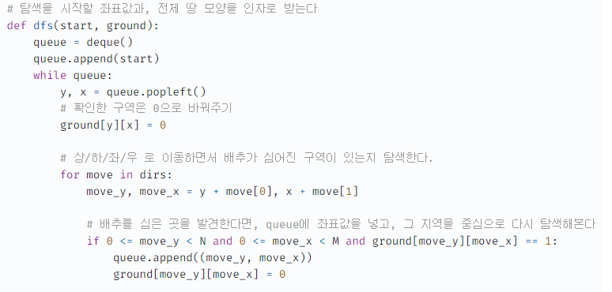

### 문제

[유기농 배추](https://www.acmicpc.net/problem/1012)

전형적인 2차원 배열 그래프 탐색 문제입니다. DFS, BFS 중 그 무엇을 선택하더라도 괜찮습니다.


최초에 RecursionError가 발생하여 recursion limit을 10,000으로 재설정해주었습니다. 찾아보니 백준의 기본 recursion limit은 1,000이라고 하네요.


### 코드

``` python
import sys
sys.setrecursionlimit(10000)

Dir = [[-1,0],[1,0],[0,1],[0,-1]]
M, N, K = 0,0,0

def isValid(y, x) :
  return y>=0 and y<N and x>=0 and x<M

def dfs(MAP, visited, y, x) :
  visited[y][x] = True
  for i in range(4) :
    dy = y + Dir[i][0]
    dx = x + Dir[i][1]
    # print("dy, dx: ", dy, dx)
    if isValid(dy,dx) and MAP[dy][dx] == 1 and not visited[dy][dx] :
      # print("dfs dy dx : ", dy, dx)
      dfs(MAP,visited,dy,dx)
  return visited

def _1012() :
  T = int(input())
  for _ in range(T) :
    global M, N, K
    M, N, K = map(int, input().split())
    MAP = [[0]*M for _ in range(N)]
    visited = [[False]*M for _ in range(N)]
    for _ in range(K) :
      x, y = map(int, input().split())
      MAP[y][x] = 1

    cnt = 0
    for y in range(N) :
      for x in range(M) :
        if MAP[y][x] == 1 and not visited[y][x] :
          cnt += 1
          visited = dfs(MAP, visited, y, x)

    print(cnt)
  
_1012()
```


바로 지난 시간에 재귀 없이 풀겠다고 말했지만, 익숙한 대로 재귀로 풀었네요.

아니나 다를까 recursion error가 발생하여 재귀 최대 깊이를 새로 설정해주었습니다.

확실히 재귀없이 dfs로 짜는 방법을 파이썬에서는 조금 더 익숙하게 사용하는 것 같습니다. 코드는 하단을 참고하시면 되겠습니다. (일부만 업로드하니 전체 코드는 링크로 접속 후 확인하시면 되겠습니다.)



출처 : [@dek1313님의 벨로그]([https://velog.io/@dek1313/AlgorithmBOJ-1012%EB%B2%88-%EC%9C%A0%EA%B8%B0%EB%86%8D-%EB%B0%B0%EC%B6%94](https://velog.io/@dek1313/AlgorithmBOJ-1012번-유기농-배추))

