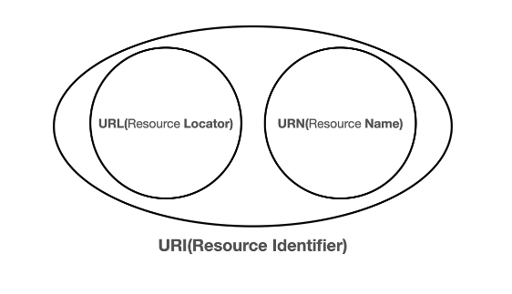
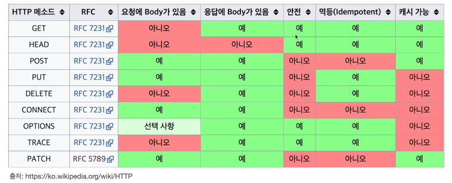

# HTTP 웹 기본지식

해당 강의는 인프런 김영한 개발자님의 [모든 개발자를 위한 HTTP 웹 기본 지식]([https://www.inflearn.com/course/http-%EC%9B%B9-%EB%84%A4%ED%8A%B8%EC%9B%8C%ED%81%AC](https://www.inflearn.com/course/http-웹-네트워크))을 수강하며 남기는 정리본입니다. 이해를 돕기 위한 자세한 공부와 실제 코드, 동작은 해당 강의를 결제하여 수강해주세요! 유료강의 첫 결제가 어렵지, 한 번 하고나면 무료강의로는 접하기 어려운 높은 퀄리티의 강의로 공부하실 수 있습니다.


### 인터넷 통신

인터넷 네트워크 망에 기반하여 HTTP 통신이 이루어진다.


### IP(인터넷 프로토콜)

네트워크 상에서 통신하기 위한 규약. 지정한 IP 주소에 패킷이라는 통신 단위로 데이터를 전달하게 된다.

- IP 패킷 : 출발지 IP, 목적지 IP, 전송데이터 등을 포함한다.

- 출발 IP 주소에서 목적 IP 주소까지 갈 수 있도록 많은 루트를 거쳐서 목적 IP 주소에 도착하게 된다.
- 목적 IP 주소에선 잘 받았다는 신호 등을 담은 **서버패킷**을 다시 클라이언트로 던진다.


### IP 프로토콜의 한계

1. 비연결성 : 패킷 받을 대상이 없더라도, 서비스가 불능이어도 패킷을 무작정 보냄.
   - 대상 서버가 패킷을 받을 수 있는 상태인지 확인하지 않고 일단 보낸다.
2. 비신뢰성 : 중간에 패킷이 사라지거나 순서대로의 도착을 보장해주지 않음.
   - 서버 문제 등으로 패킷이 유실되기도 함.
   - 순서 보장 X 
3. 프로그램 구분 : 같은 IP를 사용하는 서버에서는 어떤 어플리케이션이 요청한건지 어떻게 구별할 것인가?


### TCP/UDP

HTTP의 패킷 손실과 순서 보장 불가능한 단점을 보완하기 위함.

- 인터넷 프로토콜 스택의 4계층
  1. 어플리케이션 계층 (HTTP, FTP)
     - 웹 브라우저, 네트워크 게임, 채팅프로그램
     - 프로그램이 생성한 명령이 **SOCKET 라이브러리**를 통해 OS로 전달된다.
  2. 전송 계층 (TCP, UDP)
     - OS
     - TCP 정보 생성, 메시지 데이터 포함
  3. 인터넷 계층 (IP)
     - OS
     - IP 패킷 생성, TCP 데이터 포함
       - IP패킷 : 출발지 IP, 목적지 IP 등의 정보를 포함하고 있다. {이러한 메타데이터 + 전송데이터}가 날아감.
       - TCP 세그먼트 : 출발지 PORT, 목적지 PORT, 전송 제어/순서/검증 정보 -> 순서 제어 문제를 해결하게 된다.
  4. 네트워크 인터페이스 계층
     - LAN 드라이버, LAN 장비
     - 이더넷 프레임이 포함이 되어서 날아간다.


### TCP(Transmission Control Protocol)

1. 연결 지향 - TCP 3 way handshake (연결을 한 후에 메세지를 보낸다.)
2. 데이터 전달 보증 (패킷이 누락되면 이를 알 수 있게 해준다.)
3. 순서 보장

- 신뢰할 수 있는 프로토콜


### TCP 3 way handshake

1. 클라이언트->서버 : `SYN` (접속 요청)

2. 서버->클라이언트 : `SYN` + `ACK`

3. 클라이언트->서버 : `ACK` (요청 수락) => 요즘은 발전해서 이 단계에서 데이터 전송하기도

4. 클라이언트<->서버 : 데이터 전송


### UDP(User Datagram Protocol)

IP와 거의 같은데 PORT + checksum(메세지가 잘 왔는데 검증해주는 데이터) 정도만 추가됨.

안정성은 없는데 빠름. 깨져도 되는 영상같은건 UDP로 보냈었음. 최근에는 90% 이상 TCP로 보냈는데, 이젠 다시 UDP가 뜨고 있다. 


### PORT

한번에 둘 이상 연결해야하는 경우를 대비하여 패킷에 출발지, 도착지 PORT를 포함한다. 같은 IP 내에서 프로세스를 구분하는 개념.

- 0~65536 : 할당 가능
- 0~1023 : 잘 알려진 포트이므로 사용하지 않는 것이 좋다.


### DNS 도메인 네임 시스템

IP는 변경될 수 있고 기억하기도 어려우므로 사용한다. DNS 서버에 도메인 명, IP가 매핑되어 존재함.


### URI



- `shceme://[userinfo@]host[:port][/path][?query][#fragment]`
- query는 `?`로 시작, query parameter(=query string)은 &으로 추가할 수 있다.
- fragment : html 내부 북마크 등에 사용 (서버로 전송x)

### 웹 브라우저 요청 흐름

- URI 입력 -> HTTP 메시지 생성

```
GET /search?q=hello&hl=ko HTTP/1.1
Host: www.google.com
```

- HTTP 메시지를 웹 패킷에 담아서 보내면, HTTP 응답 메시지가 온다.

```
HTTP/1.1 200 OK
Content-Type:text/html;charset=UTF-8
Content-Length:3423

<html>
	<body>...</body>
</html>
```

- 웹 브라우저가 HTML 렌더링을 하면 클라이언트에서 HTML이 띄워진다.


### HTTP

HTTP 메시지에 모든 것이 전송됨. 거의 모든 형태의 데이터가 전송 가능하다. 서버간에 데이터를 주고 받을 때도 대부분 HTTP를 사용하게 된다.

**HTTP/1.1**을 주로 씀. HTTP/2은 2015년에 나왔고, HTTP/3은 TCP 대신 UDP를 사용. 2, 3은 성능 개선에 초점이 맞춰져있다.

- TCP: 1.1, 2. TCP 프로토콜 기반으로 만들어짐.
- UDP: 3.
- 2, 3도 점점 증가하는 추세


### 클라이언트와 서버 구조

클라이언트는 UI에 집중, 서버는 비즈니스 로직 등을 처리. 양쪽이 독립되어 있는게 핵심이다. 그래서 요청 보내고 응답 보내는 구조가 만들어졌다.


### 무상태 프로토콜 : 스테이스리스Stateless

- 클라이언트 측에서 필요한 내용을 담아서 모두 전송한다. (Context가 존재하지 않는다는 가정 하에 설계한다.)
- 장점 : 어떤 서버라도 요청에 대한 응답을 보낼 수 있다. (확장성) (ex. 갑자기 요청이 늘어나더라도 서버를 증설하기만 하면 응답을 보낼 수 있다.)
- 확장성 = 스케일 아웃(수평 확장) 에 유리하다.
- 한계 : 로그인 상태 유지 등을 해야하기도 함. (쿠키, 서버 세션 등 사용하여 상태 유지) + 데이터를 너무 많이 보낸다.


### 비연결성

- 모든 클라이언트와 연결을 유지한다면? 서버는 연결유지하느라 자원 손실 많이 한다.

- 동시에 처리하는 요청은 수십개 이하로 매우 작다. (ex. 한 명이 계속 검색을 누르진 않음)

- 단점1 : TCP/IP 연결을 매번 새로 맺어야 한다. - 3 way handshake 시간 추가
- 단점 2 : 한 번 누를 때마다 많은 자원이 다운로드 된다
  - HTTP 지속 연결로 문제 해결 : 자원 다운로드가 끝날 때까지 기다렸다가 연결을 끊는다.
  - HTTP2에서는 보다 최적화된다

- 같은 시간에 딱 맞추어 발생하는 대용량 트래픽(ex. 선착순 이벤트)을 해결하기 위해 stateless하게 잘 설계를 해야 한다.


### HTTP 메시지

HTTP 메시지 구조

- 시작 라인 : GET, POST, PUT, DELETE, ... + 요청 메시지(요청 대상. 절대 경로로 시작하는 경로)
- 헤더 = field-name":"OWS field-value OWS (OWS:띄어쓰기 허용)
- 공백라인(CRLF)
- message body : byte로 압축가능한 내용은 모두 가능하다.


### HTTP 메서드

- API URI 설계
  - Restful : **리소스** 식별이 쉽게 만들어져야 한다.
  - 리소스는 명사, 행위는 동사고 URI는 **리소스**만을 표현해야 한다.
    - 정말 프로세스 상 명사만 사용할 수 없는 경우에는 **컨트롤 URI**를 사용하기도 한다.
  - 행위는 HTTP 메서드로 표현하게 된다.
- HTTP 메서드 - GET, POST
  - GET : 리소스 조회
  - POST : 요청 데이터 처리 (주로 등록)
  - PUT : 리소스 대체, 해당 리소스가 없으면 생성
  - PATCH : 리소스 부분 변경
  - DELETE : 리소스 삭제
  - 기타 : HEAD(메시지 제외하고 헤더만 반환), OPTIONS(통신 가능 옵션 설명), CONNECT(서버에 대한 터널 설정), TRACE(메시지 루프백 테스트 수행)
- GET
  - 리소스 조회
  - 메시지 바디를 사용해서 데이터를 전달할 수는 있는데, 지원하지 않는 곳이 많아서 권장하지 않는다.
- POST
  - 요청 데이터 처리. 메시지 바디를 통해 서버로 요청 데이터 전달 (json 타입 등으로 데이터가 서버로 넘어가게 된다.) -> 서버는 해당 요청 데이터를 처리한다.
    1. 클라이언트에서 데이터가 포함된 리소스 전달
    2. 서버에서 신규 리소스 생성
    3. 서버에서 응답 데이터 반환, Location에 리소스의 위치가 들어있다.
  - 공식 스펙에 기술된 내용
    1. HTML 양식에 입력된 필드와 같은 데이터 블록을 데이터 처리 프로세스에 제공(FORM으로 넘어오는 회원가입)
    2. 게시판, 뉴스 그룹, 블로그 등에 메시지 게시 (게시판 글쓰기, 댓글 달기)
    3. 서버가 아직 식별하지 않은 새 리소스 생성 (신규 주문 생성)
    4. 기존 자원에 데이터 추가 (한 문서 끝에 내용 추가하기)
  - 정리
    1. 새 리소스 생성(등록)
    2. 요청 데이터 처리 (단순히 생성, 변경하는 것을 넘어서 내부 로직을 통한 **프로세스**를 처리해야하는 경우. 이 결과로서 반드시 새로운 리소스가 생성되는 것은 아니다.)
    3. 다른 메서드로 처리하기 애매한 경우 (json으로 데이터 넘겨야 하는데, GET을 사용하기에는 어려운 경우)

- PUT
  - 리소스를 대체하고, 리소스가 존재하지 않으면 생성한다.
  - 클라이언트가 리소스 위치를 지정해서 보냄. (POST는 `POST /members` 이렇게만 보냈는데, PUT은 `PUT /members/100` 이런 식으로 리소스 위치를 정해서 보냄)
    - 이미 리소스가 존재하면 대체한다.
    - 리소스가 없으면 생성한다.
  - 리소스를 완전히 대체하므로, 필드명을 실수하거나 필드를 까먹는 경우에는 그 필드가 사라지거나 잘못되어버린다.
- PATCH
  - 리소스를 부분 변경하기 위해 사용한다. 
- DELETE
  - 리소스의 위치를 보내서 해당 리소스를 삭제한다.


### HTTP 메서드의 속성



- 안전 Safe
  - 호출해도 리소스를 변경하지 않는다. (POST, PUT, PATCH, DELETE... 위험하다.)
- 멱등 Idempotent
  - f(f(x)) = f(x). 한 번 호출하든 100번 호출하든 결과가 같아야 한다는 의미.
  - **POST**는 멱등이 아니라는 점에 유의. 두 번 호출하면 같은 결제가 중복해서 발생할 수 있다.
  - 외부 요인으로 중간에 리소스가 변경되는 것까지는 고려하지 않습니다.
- 캐시 가능 Cacheable
  - 응답 결과 리소스를 캐시해서 사용해도 되는가?
  - 실제로는 **GET**, HEAD 정도만 캐시로 사용한다.
  - POST, PATCH는 **본문 내용**까지 캐시 키로 고려해야 하는데, 구현이 쉽지 않아 거의 사용하지 않는다.


### HTTP 메서드 활용

- 클라이언트에서 서버로 데이터 전송
  1. 쿼리 파라미터(쿼리 스트링)를 통한 데이터 전송

     - URI 끝에 쿼리 스트링을 넣어 데이터를 전송하는 형식.

     - GET, 정렬 필터(검색어, 정렬 조건 등)

  2. 메세지 바디를 통한 데이터 전송

     - POST, PUT, PATCH를 주로 사용한다.

     - 회원 가입, 상품 주문, 리소스 등록, 리소스 변경


### 클라이언트에서 서버로 데이터 전송하기

1. 정적 데이터 조회 (이미지, 정적 텍스트 문서 등을 조회)
   - 쿼리 파라미터 사용하지 않고, **GET**으로 리소스 경로 조회 요청 (ex. `GET /static/start.jpg`)
2. 동적 데이터 조회 (정렬 필터, 검색어)
   - 쿼리 파라미터를 포함하여 **GET**으로 조회 요청을 보내면, 서버는 쿼리 파라미터를 기반으로 정렬하여 결과를 **동적으로 생성**한 후 보내 준다. (ex. 게시판 목록, 검색어)
3. HTML Form (폼에 작성하고 보내기)
   - post : 폼에 작성된 내용을 클라이언트에게 post method로 request 보낸다. 서버는 해당 데이터를 받아 데이터베이스를 업데이트하는 등의 작업을 한다.
     - Content-Type:application/**x-www-form-urlencoded**, body단에 `username=kim&age=20` 이런 식으로 넘어오는 모양이다.
     - x-www-form-urlencoded는 html form을 post로 보낼 때의 디폴트 값인 모양입니다. 이는 **`&`으로 분리되고, `=` 기호로 값과 키를 연결하는 key-value tuple로 인코딩**된다고 합니다. 이름에서 알 수 있듯 url encoding처리도 같이 됩니다. (김->`%EA%B9#90`)
   - get : 폼에 작성된 내용을 클라이언트에게 get method로 request를 보낸다. 서버는 해당 데이터를 받아 **조회**하고, **조회 결과 등**을 반환해준다. (ex. 아이디-비밀번호 매칭 여부 판별)
     - Content-type이 따로 없고, 리소스 요청에서 url에 붙여서 넘어오는 모양입니다. 가령 `GET /save?username=kim&age=20 HTTP/1.1` 이런 식으로요. 그래서 보안성이 안 좋은 모양.
   - POST - multipart/form-data
     - 클라이언트 : form에서 enctype="multipart/form-data"로 옵션 넣어주면 웹 브라우저 상에서 reque http 메시지를 생성할 때, `Content-type: multipart/form-data; boundary=-----XXX Content-Length: 10457 ... -------XXX ........ ------XXX--` 이런 방식으로 메시지 바디에 추가되어 넘어오는 모양이다. boundary의 가장 끝에는 `--`가 붙어있음 주의.
4. HTTP API 
   - json format 등으로 보내는 거. 백엔드 시스템 통신, 앱 클라이언트, 웹 클라이언트(Form 대신 자바스크립트를 통한 ajax 통신).
   - Content-Type은 주로 `application/json`. (XML에 비해 크기도 작고 가독성 좋기 때문이다.)