### 문제


[벽 부수고 이동하기](https://www.acmicpc.net/problem/2206) 문제를 풀었습니다.  `solved.ac` 기준 Gold 4 난이도였고, 처음에는 조건이 복잡한 BFS라고 생각했으나 visited 배열의 활용 자체가 달라지는 문제였습니다.


### 첫 접근

단순 BFS이되, queue에 `벽을 부수었는지 여부`를 넣어서, 이전에 부순 적이 있다면 벽을 부수어야 하는 선택지는 queue에 담지 않는다.

왜 틀렸을까요? 문제가 되는 테스트케이스는 아래와 같습니다.

```
6 3
000
110
000
011
111
000
```

자신이 컴퓨터가 되었다고 생각하며 기존의 BFS 알고리즘을 따라 문제를 풀어보면 왜 풀리지 않는지를 알 수 있습니다.

우선 첫 번째, BFS의 시작 (node로 그 어떤 것도 넣기 전 혹은 start인 (1,1)만 넣었을 때)의 배열의 모습입니다.

### 맨 처음 배열의 모습

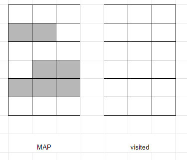

회색은 벽입니다. 데이터 상으로는 1로 표현되어있죠. visited는 모두 false인 상태입니다.

### BFS 첫 번째 노드들 넣기

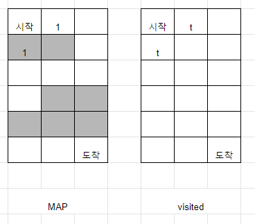

첫 번째로 이동할 노드들을 큐에 넣기 위해 BFS의 while문(혹은 재귀)을 반복하며 `1`이 체크된 곳을 방문할 것입니다. (1,2)에서는 벽을 부수었다는 플래그를 갖고 갈테고, (2,1)은 벽을 부순 적 없다는 플래그를 갖고 노드가 큐에 들어가게 됩니다.

### BFS 두 번째 노드들 넣기

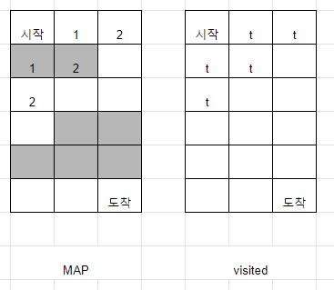

두 번째는 `2`가 체크된 곳들을 방문할 것입니다. 큐에 들어가있던 노드들과 인접한 노드들이죠.

(1,3) : 벽을 뚫고 이동함

(2,2) : (2,1)에서 벽을 뚫고 이동함 ( (1,2)에서는 못옵니다. 이미 벽을 뚫었으니까요. )

(3,1) : (2,1)에서 벽을 안뚫고 이동함

### BFS 세 번째 노드들 넣기

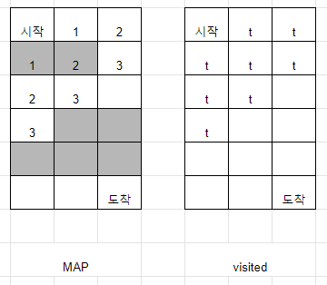

세 번째는 `3`이 체크된 곳들을 방문할 것입니다. `2`와 인접한 노드들을 방문하는 아주 간단한 상황입니다.

(1,4) : (1,3)에서 이동, 벽을 뚫은 적 있음

(2,3) : (2,2)에서 이동, 벽을 뚫은 적 있음

(3,2) : (3,1)에서 이동


### <a name="why">BFS 네 번째 노드들 넣기 (문제상황)</a>

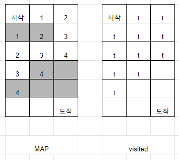

`4`가 체크된 곳들을 방문합니다. 하나하나 살펴보면,

(1,5) : (1,4)에서 이동, 벽을 뚫은 적 있는데 또 벽을 뚫으려고 함 -> 이동 불가

(2,4) : (1,4) or (2,3)에서 이동, 벽을 뚫은 적 있어서 이동 불가

(3,3) : (2,3) or (3,2)에서 이동, (2,3)은 벽을 뚫은 적 있어서 이동 불가, (3,1)은 이동 가능

이제 앞으로 나아갈 수 있는 건 (3,3)뿐이네요? 정리하자면 아래와 같은 모양이 됩니다.

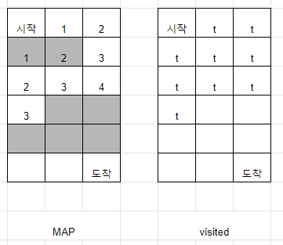

이 다음은 어떻게 될까요?

### 다섯 번째 이동

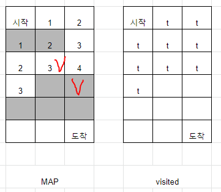

빨간 V로 표시한 곳으로 이동하려고 할 것입니다.

(2,3) => 이미 방문한 적 있으므로 이동이 불가능합니다.

(3,4) => 이동은 가능하긴 한데 벽이네요? 드디어 벽을 뚫습니다. 아래와 같은 그림이 됩니다.

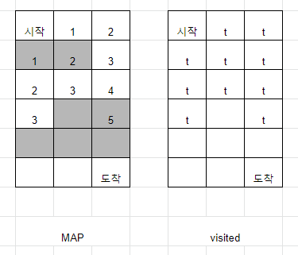

### 여섯 번째 이동

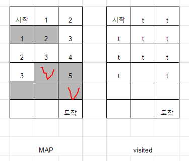

V표시 한 곳으로 진행하려고 시도하지만, 이미 벽을 뚫은 적이 있기 때문에 이동하지 못합니다. 분명히 길이 있음에도 불구하고, 길찾기를 하지 못한 채 -1을 출력하며 끝이 납니다.

왜 이런 문제 상황이 발생했을까요? 분명히 구분되어야 하는 루트가 구분되지 않아서 그렇습니다. 즉, (1) 벽을 뚫은 적 있는 루트와 (2) 벽을 뚫은 적 없는 루트가 구분이 되어야 하는데, 그렇지 않고 함께 **방문여부 체크**를 해주다보니 아래와 같은 상황이 발생하고 있습니다.

### 왜 발생하는가?

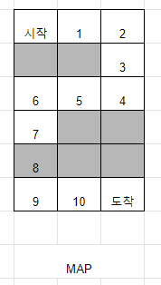

우리가 원하는 루트는 위와 같습니다. 하지만 저 루트로 가는 길은 <a href="#why">네 번째 이동</a>에서 이미 막혔습니다.

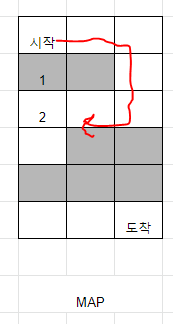

이미 벽을 뚫고 이동한 루트에서 `visited[dy][dx]==True` 를 해버렸기 때문에, 해당 칸을 탐색하지 않는 까닭입니다.

# 해결책

해결은 visited 배열에 차원을 하나 추가하는 것으로 가능합니다. BFS에서 visited를 사용하는 이유는 무엇일까요? 나와 **같은 조건**을 들고 루트를 만들어나가는 수 많은 노드들이, 이미 이전에 탐색한 곳을 쓸데없이 다시 탐색하지 않도록 하기 위함입니다. 방문 조건없이 탐색을 하는 경우에, 아래의 배열을 생각해볼까요?

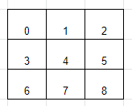

0이 시작이라고 생각해보면, BFS는 인접한 노드들을 계속 살펴가면서 가장 먼저 목표점에 도착하는 루트를 찾아내는 알고리즘이므로, 맨 처음에는 다음과 같은 동작을 합니다.

- 0 차례 : 나의 인접노드 1, 3을 탐색해야겠다!

해당하는 인접노드 1, 3을 큐에 넣고, 큐를 맨 앞에서부터 빼면서(큐는 선입선출구조였죠?) 그 인접 노드들을 탐색하는 방식입니다. 그렇다면 다음에는 이런 동작을 할 것입니다.

- 1 차례 : 나의 인접노드 0, 2, 4를 탐색해야겠다!
- 3 차례 : 나의 인접노드 0, 4, 6을 탐색해야겠다!

뭔가 이상하죠? 이미 이전에 방문했던 노드0을 또 방문할 뿐만 아니라, 1 차례에서 탐색했던 노드4를 재차 방문하며 불필요한 자원소모를 하고 있습니다. 심지어 노드0을 재방문한다면, 노드0은 다시 노드1,3을, 노드1,3은 다시 노드0을, ... 서로 끊임없이 방문하면서 무한루프를 돌게 됩니다.

이를 방지하기 위해 우리는 visited 배열을 사용해 방문 여부를 체크하게 됩니다. 그런데, visited 에서 방문 여부를 함께 체크하고 있는 노드들은 다 같은 조건을 갖고 갑니다. 일상생활에서의 예를 생각해보면, A에서 Z로 가는 길을 찾고 있는 두 사람이 있되, 한 사람은 편의점이 가장 많은 길을 가고 싶어하고, 한 사람은 식당이 가장 많은 길로 가고 싶어합니다. 이 경우에 한 사람이 B 지점에 방문해서 "여기는 편의점이 2개 있구나!" 하며 방문 완료에 체크를 하더라도, 식당의 갯수를 세는 한 사람은 당연히 B 지점에 다시 방문을 해서 식당의 갯수를 세어주어야 할 것입니다.

이처럼 visited 배열에서 방문 여부를 체크하는 노드들은 **같은 조건 하에 탐색 중** 임을 전제하고 있습니다. 

### 3차원 visited 배열

해당 문제에서는 두 명의 탐색자가 존재합니다.

1. 한 번이라도 벽을 뚫은 탐색자
2. 한 번도 벽을 뚫지 않은 탐색자

어떤 탐색자건간에, 벽을 뚫는 순간 **한 번이라도 벽을 뚫은 탐색자**로서의 노드가 됩니다. 한 번이라도 벽을 뚫은 탐색자들은, 같은 visited 배열을 공유하며 "한 번 벽 부숴본 사람으로서, 이 길은 딱히 체크 안 해도 된다! 내가 이미 체크했어." 라고 다른 (벽을 뚫어본) 노드들에게 말할 수 있습니다. 한 번도 벽을 뚫지 않은 탐색자들은, 한 번이라도 벽을 뚫어본 탐색자들과 같은 visited 배열을 공유해선 안됩니다. (식당 갯수 세는게 목적인 탐색자들과, 편의점 갯수 세는게 목적인 탐색자들이 같은 visited 배열을 공유해선 안되듯이 말입니다.)


# 답 코드

```python
# 2206 벽 부수고 이동하기

from collections import deque
Dir = [[-1,0],[1,0],[0,-1],[0,1]]
MAP = []
N = 0
M = 0
visited = []

def isValid(x, y) :
  return (0 <= x < M) and (0 <= y < N)

def bfs(start, target) :
  global visited, MAP
  q = deque([(start, False, 1)])
  visited[0][0][0] = True
  visited[0][0][1] = True
  while q :
    node = q.popleft()
    x, y = node[0][1], node[0][0]
    brokenWall = node[1]
    cnt = node[2]
    for i in range(4) :
      dx = x + Dir[i][0]
      dy = y + Dir[i][1]
      
      if isValid(dx, dy) and (not visited[dy][dx][0] or not visited[dy][dx][1]) :
        if (dy,dx) == target :
          return cnt+1 

        if brokenWall :
          if not visited[dy][dx][1] and MAP[dy][dx] == 0 :
            visited[dy][dx][1] = True
            q.append(((dy,dx),brokenWall, cnt+1))
        else :
          if not visited[dy][dx][0] :
            if MAP[dy][dx]==0 :
              visited[dy][dx][0]=True
              q.append(((dy,dx),brokenWall,cnt+1))
            elif MAP[dy][dx]==1: 
              visited[dy][dx][1]=True
              q.append(((dy,dx),True,cnt+1))


  return -1

def _2206() :
  global MAP, visited, N, M
  N, M = map(int,input().split())
  
  MAP = [[0]*M for _ in range(N)]
  visited = [[[False]*2 for _ in range(M)] for _ in range(N)]
  # print(visited)
  for y in range(N) :
    arr = list(input())
    for x, n in enumerate(arr) :
      MAP[y][x] = int(n)

  start = (0,0)
  target = (N-1,M-1)
  if start == target :
    print(1)
  else : print(bfs(start, target))

  return 0


_2206()
```


`visited[dy][dx][1]`은 벽을 부순 적 있는 노드들이, `visited[dy][dx][0]`은 그렇지 않은 노드들이 공유하는 방문 체크 배열입니다.


**벽을 부순 적 있는 노드**

	1. 다음 노드가 벽임 : 못간다.
 	2. 다음 노드가 벽이 아님 : 갈 수 있음. 
     - 단, `visited[dy][dx][1]==False` 여야 갈 수 있다.
     - `visited[dy][dx][1]=True`로 표시

**벽을 부순 적 없는 노드**

1. 다음 노드가 벽임 : 갈 수 있음.

   - 단, `visited[dy][dx][1]==False` 여야 갈 수 있다.

   - `visited[dy][dx][1]=True`로 표시하고, 벽을 이미 부순 노드임을 표시(`brokenWall=True`)

2. 다음 노드가 벽이 아님 : 갈 수 있음. 

   - 단, `visited[dy][dx][0]==False` 여야 갈 수 있다.
   - `visited[dy][dx][0]=True`로 표시