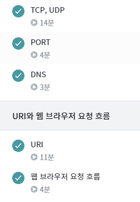
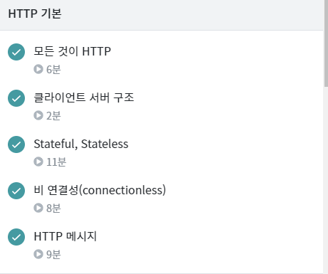

# TIL

# 🎉

### CP

- 2206 벽 부수고 이동하기 풀고 [풀이 업로드](https://joomal.github.io//2206cp/) (좀 신기한 문제였어서 길게 풀이를 썼습니다)

### HTTP 강의

### 잠깐의 코딩

- 포트폴리오가 부족하다는 생각에 급박하게 Todolist라도 만들기 위해 허겁지겁 인텔리제이를 켜서 갑자기 로그인페이지와 내용 구현을 하다가 버튼이 못생겨서 부트스트랩을 공부하다가 정신차리고 원래 공부로 돌아왔습니다...

# ✨

- Notion 포트폴리오 : Studying, Reading 추가
- J2KB 제안서 회의 - 최종완료

