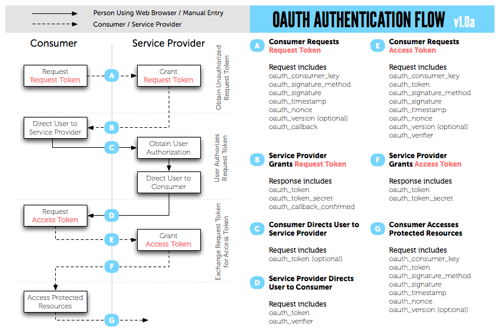
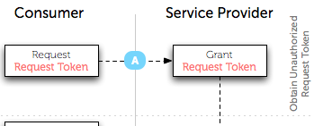
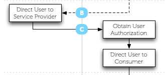
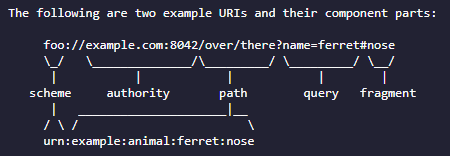
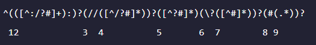
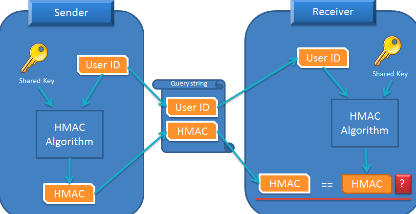

# 목차

[TOC]

# OAuth

OAuth는 **인증을 위한 오픈 스탠더드 프로토콜**을 의미한다.

- OpenID : Authentication인증이 주요 목적
- OAuth : Authorization허가가 주요 목적

특정 API를 호출할 수 있는 **권한**이 있는 사용자인지 확인하는 것임. 가령 페이스북에서 김뚝딱이라는 사람의 담벼락에 글을 쓸 권한이 해당 사용자에게 존재하는가의 여부를 파악하는 것이다.

# OAuth 1.0

### OAuth Dance

OAuth를 이용하여 사용자를 인증하는 과정을 **OAuth Dance**라고 한다. 진짜 춤을 추듯이 두 명이 정보를 주고받는 과정을 재미있게 명명한 것이다.

1. Consumer가 Request Token을 Request합니다.
2. Service Provider가 Request Token을 **부여(Grant)** 해주고, token 관련된 정보들을 Response로 넘겨줍니다.
3. Consumer가 Access Token을 요청합니다.
4. Service Provider가 Access Token을 부여합니다.
5. Consumer는 이제 Protected Resources에 접근 가능해집니다.

위의 과정에서 주고받는 Token들의 매개변수에 대해 자세히 알아보겠습니다.

# Request Token

### Consumer -> Service Provider

**Consumer가 Service Provider에게 Request Token을 요청할 때 사용되는 매개변수** (위의 표 참조)

- oauth_consumer_key : Consumer를 구별하는 고유한 값.
- oauth_signature_method : oauth_signature를 암호화하는 방법. HMAC-SHA1, HMAC-MD5 등을 사용할 수 있다.
- **oauth_signature** : 서명값. OAuth 인증 정보를 암호화하고 인코딩하여 만든다. 인증 정보는 매개변수 중에서 oauth_signature를 제외한 나머지 매개변수와 HTTP 요청 방식을 **문자열로 조합한 값**이다.
- oauth_timestamp : 요청을 생성한 시점의 타임스탬프. 1970-01-01 00:00:00 이후의 시간을 초로 환산한 초 단위의 누적 시간
- oauth_nonce : Consumer에서 임의로 생성한 문자열. timestamp의 값이 같은 요청에서는 유일한 값이어야 한다. (악의적인 목적으로 계속 요청을 보내는 걸 막기 위해서라는데, 이게 Consumer의 고유값으로서 Service Provider가 분별할 수 있도록 해주거나 하는듯? 혹은 한 Consumer는 1초에 1개의 요청만 보낼 수 있다거나?)
- oauth_version (optional) : 1.0a는 1.0이라고 명시해주면 된다.
- oauth_callback : 인증을 완료한 후 리다이렉트할 웹 주소. (callback을 받아서 return해주면 redirect되니까.) 만약 리다이렉트할 주소가 없다면 **oob(Out Of Band)**를 보낸다고 한다.

### oauth_signature

당연히 Consumer와 Service Provider는 같은 암호화 알고리즘을 사용해야 합니다. oauth_signature를 만드는 법은 다음과 같습니다.

1. (oauth_signatrue를 제외하고, oauth_로 시작하는) 요청 매개변수를 모두 모은다. POST body에서 매개변수를 사용하고 있으면 이 매개변수도 모은다.

2. 매개변수를 정규화한다.

   - 매개변수 사전순 정렬하고,
   - 각각의 key와 value에 <a href="#rfc3986">URL 인코딩(rfc3986)</a>을 적용한다. URL 인코딩을 실시한 결과를 = 형태로 나열하고 쌍 사이에는 &을 넣는다.
   - 이렇게 나온 결과 전체에 한 번 더 URL인코딩을 적용한다.

3. **Signature Base String**을 만든다.

   - HTTP Method + Consumer가 호출한 URL 주소 + 정규화한 매개변수를 `&`을 사용해 결합합니다.

4. 키 생성

   - 위의 과정을 거쳐 생성된 문자열을 암호화합니다. 암호화할 때 Consumer Secret Key(Consumer가 Service Provider에 사용 등록을 할 때 발급받는 값으로, Consumer를 식별하는 고유한 값)을 사용하게 된다.
   - <a href="#hmac">HMAC-SHA1</a> 등의 암호화 방법을 이용하여 최종 oauth_signature를 생성한다.

   

### Service Provider -> Consumer

**Service Provider는 Consumer가 보낸 Request Token을 Grant(인증)해주고, 다음과 같은 응답을 보냅니다.**

- oauth_token : Consumer가 Request Token으로 사용할 토큰
- oauth_token_secret : Access Token으로 교환하기 위해 Service Provider가 전달해준 값 (Consumer는 이 값을 HTTP 세션이나 쿠키 또는 DBMS 등에 저장해두어야 합니다.)
- oauth_callback_confirmed

(의문 : 근데 그럼 Response로 넘어온 oauth_token_secret을.. 훔치면 안되는건가..?)

# Direct & User Authorization

### Consumer Directs User to Service Provider

- Request : oauth_token(optional)

oauth_token을 이용해 Service Provider가 정해놓은 사용자 인증 페이지를 User에게 보여주게 됩니다. Request Token을 요청하고 반환받았던 **oauth_token을 매개 변수로 Service Provider가 정해둔 사용자 인증 페이지를 유저에게 보여주게 됩니다.**

즉, 가령 OAuth를 제공하는 Service Provider가 사용자 인증 페이지를 `https://auth.com` 이라고 정해두었다면(실제로는 Service Provider를 Host로, 쿼리를 날리던가 location을 추가해서 되던가 하는 듯), oauth_token을 매개변수로 `https://auth.com?oauth_token=goaigjieaWR2z` 요런 식으로 redirect 되게 됩니다.

### Service Provider Directs User to Consumer

- Request : oauth_token, oauth_verifier

위에서 제가 의문을 가졌던.. oauth_token_secret과 oauth_token을 탈취하면 안되냐? 하는 문제에 대한 답이 되겠네요. 탈취하더라도 OAuth를 호출? 했던 클라이언트가 아니기때문에, redirect 과정을 거치며, **OAUTH AUTHENTICATION FLOW**에서 등장했던 `Obtain User Authorizaion`이 불가능하겠네요.

다시 차근차근 위에서부터 돌이켜 생각해보면, 현재까지 다음과 같은 과정을 거쳐왔습니다. 우리는 Service Provider 입장에서 개발할 가능성이 높으므로, Service Provider를 **우리**라고 칭하며 이해해보겠습니다.

1. 클라이언트가 Request Token을 요청. 이때 본인의 정보(oauth_consumer_key, oauth_timestamp, oauth_callback, ...)와 우리와 약속한 key 정보들(oauth_signature_method, oauth_signature)을 우리한테 메세지에 넣어 보내줍니다.
2. 우리는 그걸 읽고, 적합한 정보가 보내져왔다면 Grant를 해줍니다. 즉, 해싱된 값이 우리가 생각했던 그 값과 같은지, 중간에 위변조되진 않았는지를 파악해서, valid하다면 Grant를 줍니다. 어떻게 주냐면 앞으로 Consumer가 토큰으로 사용할 놈들(oauth_token, oauth_token_secret)을 담아서 Response해줍니다.
3. 클라이언트는 요청을 보냈던 유저를 직접 우리에게 보여줍니다. 어떻게 보여주냐면, 우리가 제시한 url에 oauth_token을 query로 담고 유저가 이놈이다! 하는 걸 우리한테 보여주는 겁니다.

그러면 우리는 아하, 이놈이 그놈이구만, 그래 너의 토큰 이거구나~ 하고 다시 클라이언트에게 유저를 돌려보냅니다. 유저의 손에 oauth_token과 oauth_verifier를 쥐어줘서요. 어디로 돌려보내주냐면, 클라이언트 측에서 지정했던 oauth_callback으로 돌려보내줍니다. 이때 쥐어준 oauth_token과 oauth_verifier는 Access Token을 요청할 때 사용됩니다.

### Access Token

Access Token만 있다면 이제 유저는 해당 토큰을 출입증삼아 제한이 허용된 곳들을 다닐 수 있습니다. 클라이언트는 이제 출입증을 받을 수 있도록 우리에게 Access Token을 요청합니다. 이때 메시지에 담겨 올 매개변수들은 다음과 같습니다.

**Request**

- oauth_consumer_key
- oauth_token
- oauth_signature_method
- oauth_signature
- oauth_timestamp
- oauth_nonce
- oauth_version (optional)
- oauth_verifier

우리는 위의 매개변수를 받고, 다 적합하다면 Access Token을 발급해줍니다. 이때 Response로 넘어가는 매개변수는 다음과 같습니다.

**Response**

- oauth_token
- oauth_token_secret : Consumer Secret Key에 oauth_token_secret을 &한 값을 사용해 oauth_token_secret을 생성해 전달해줍니다. (암호화 키를 변경하여 보안을 더 강화하기 위함)

### Consumer can access Protected Resources

이제 클라이언트는 권한이 필요한 오픈 API를 호출할 수 있습니다. 물론 호출할 때에 클라이언트 측에서는 발급받았던 출입증인 Access Token을 들고 다녀야겠죠?

**Request**

- oauth_consumer_key
- oauth_token
- oauth_signature_method
- oauth_signature
- oauth_timestamp
- oauth_nonce
- oauth_version (optional)

# OAuth 2.0

뼈 빠져라 OAuth 1.0을 공부했더니 OAuth 2.0이 등장했네요. OAuth 1.0이 웹 애플리케이션이 아닌 애플리케이션에서는 사용하기 곤란하다는 단점이 있고, 절차가 복잡하여 서버 측에도 연산 부담이 발생한다는 점을 개선시킨 OAuth라고 합니다. 

OAuth 2.0은 HMAC 암호화 대신 HTTPS를 사용하고, URL 인코딩 등이 없다고 합니다. 또한, Access Token의 Life-time을 지정할 수 있다고 하네요. 해당 게시글이 2012년도 게시글이니, 지금 찾아보면 이미 OAuth 2.0이 나왔을 것 같습니다.

그래서 찾아보니 아니나다를까 나왔습니다. 응? 이럴거면 그냥 OAuth 2.0을 공부할 걸 그랬나..?

OAuth 2.0의 경우에는 Request Token 대신 Refresh Token 이라는 이름의 토큰 + Access Token을 사용합니다. JWT를 공부할 때 희미하게 보았던 기억이 납니다. (Refresh Token은 Optional이라는 말도 있는데, 음.. 아직은 이해하기 어렵네요.)

OAuth 2.0을 이해하기 위해 [생활코딩 OAuth 2.0](https://opentutorials.org/course/2473/16571)을 수강하였습니다. (1.75배속으로 들으면 1시간 정도면 수강이 가능합니다.)

### 구글 클라우드 플랫폼 OAuth 2.0 사용해보기

1. Google Calendar API - API 관리자
2. APIs Explorer에서 명세를 읽고 사용한다.
   - scope : google calendar의 **list**를 가져오고 싶은 경우, 구글의 - 캘린더의 - List라는 Resource에 대한 허가를 받아야 한다. 이러한 허가 범위를 scope이라 한다.
   - 사용하기 위해서는 API Key를 request에 함께 보내주어야 한다.

### 동작 흐름

1. 사용자가 우리의 서버(Client)에 접속하면
2. 사용자의 화면에 인증을 요청하는 화면이 뜬다.
3. 사용자가 확인 버튼을 누르면 Resource Server로 접속하게 된다.
   - access_type=offline으로 설정을 하면 refresh token도 같이 보내준다. 이를 사용해 access token이 만료되었을 때, 다시 access token을 발급받을 수 있도록 할 수 있다.
   - redirect_url : authorize code값을 **클라이언트의 어느 주소로 쏴줄까** 
4. 사용자의 화면에 클라이언트가 필요로 하는 scope list를 보여주고 Resource Server가 Client에게 동의를 구한다.
5. 동의를 하면, Resource Server가 Client에게 Authroize Code를 보낸다. (가령 구글의 list를 볼 수 있게 해주겠다 하는 비밀번호)
6. 클라이언트가 code, client id, client secret을 Resource Server로 보낸다.
7. Resource Server는 Access Token을 클라이언트에게 보낸다.
8. 클라이언트는 Access Token을 사용해 API를 사용할 수 있게 된다.
   - refresh token은 최초 발행 시에만 발급받을 수 있다. 해당 refresh token은 잘 보관했다가 추후에 **갱신**할 때에 사용해야함.

# 추가 공부 자료

### URL 인코딩(rfc3986)

rfc3986이란 URI(Uniform Resource Identifier)의 표준 문법을 의미한다.

인터넷 상의 정보 리소스를 고유하게 식별하기 위해 사용합니다. 문법의 세부 내용은 위와 같습니다.

- scheme : 리소스에 접근할 때 사용하는 프로토콜 (ex. http:, https:, ftp:, ...)
- authority : 호스트 정보입니다. 호스트의 도메인 + 포트번호로 이루어져 있습니다.
- path : 리소스의 위치를 의미합니다.
- query : ? 뒤로 query가 들어가게 됩니다.
- fragment : 서버로는 넘어가지 않는 부분입니다. http 내부 검색 등에 사용됩니다. (목차를 누르면 게시글 내부의 어떤 곳으로 이동하는 등)

 URI의 창시자가 만든 정규식은 아래와 같습니다. 아래의 정규식을 사용해 상대 URL을 절대 URL로 파싱할 수 있습니다.

 URL 인코딩이란, **문자나 특수문자를 웹 서버와 브라우저에서 보편적으로 허용되는 형식으로 변화시키는 메커니즘**을 의미합니다. ASCII 문자 집합만을 전송 가능하므로, 안전하지 않은 외부 문자는 `%+16진수` 형태로 변화시킵니다.

### H-MAC

H-MAC(Hash-based Message Authentication Code)이란 메세지 위변조를 막는 암호화기법 중 하나입니다.

간단하게 말해 Hash를 사용하는 암호화 기법이라고 보면 되겠습니다. 동작을 간단하게 살펴보면, 

1. 수신자는 Shared Key(수신자와 송신자가 별도 채널로 공유하는 키)를 사용하여 User ID를 해시한다.
2. 원본 User ID와 그 해시 결과(HMAC)을 쿼리스트링 값으로 송신자에게 전달한다.
3. 수신자는 전달받은 User ID를 Shared Key를 사용하여 동일한 알고리즘으로 해시하고, 그 결과(Receiver's HMAC)을 만듭니다.
4. Receiver's HMAC과 쿼리스트링으로 받은 HMAC이 같다면, User ID는 변경되지 않았다고 신뢰할 수 있습니다.

그렇다면 뒤에 붙어있는 SHA1은 무엇을 의미할까요? **해시 알고리즘으로 SHA1을 사용**한다는 의미입니다. SHA란 Secure Hash Algorithm의 줄임말인데요. 임의 길이의 입력 데이터를 160 bits의 출력 데이터로 바꾸는 해싱 기법입니다. 입력한 글자수와 상관 없이 **일정한 길이의 결과값**을 반환합니다!

해당 게시글은 2013년도의 게시글을 바탕으로 공부한 포스팅인 까닭에 **SHA1**이 주요 예시가 되었는데, SHA1의 경우에는 현재는 해독의 가능성과 해시 충돌이 발생하였기 때문에 주요 브라우저에서도 지원을 중단한 상황입니다.

SHA는 여러 시리즈가 있는데요. 종종 보이는 SHA-256의 경우에는 SHA의 2번째 시리즈, 그 중 다이제스트의 길이가 256byte인 것을 SHA-256이라고 부릅니다.  (비트코인에서 사용되는 해싱 알고리즘이 SHA-256입니다.) 다이제스트(Digest)란 **해싱 함수가 적용된 결과물**을 의미합니다.

(Input data는 message라 불리고, output은 message digest 혹은 the digest라고 불린다고 합니다.)

# References

[OAuth와 함께 춤을](https://d2.naver.com/helloworld/24942)

[URL 인코딩](https://johngrib.github.io/wiki/URI/)

[H-MAC SHA-1](https://linkhub.tistory.com/3)

[Cryptographic hash function](https://en.wikipedia.org/wiki/Cryptographic_hash_function)

[OAuth 2.0]([https://velog.io/@undefcat/OAuth-2.0-%EA%B0%84%EB%8B%A8%EC%A0%95%EB%A6%AC](https://velog.io/@undefcat/OAuth-2.0-간단정리))

[RFC 6749, OAuth 2.0 구현하기]([https://velog.io/@undefcat/RFC-6749-1.-OAuth-2.0-%EA%B5%AC%ED%98%84%EA%B8%B0](https://velog.io/@undefcat/RFC-6749-1.-OAuth-2.0-구현기))

[생활코딩 - OAuth 2.0 사용하기](https://opentutorials.org/course/2473/16571)

