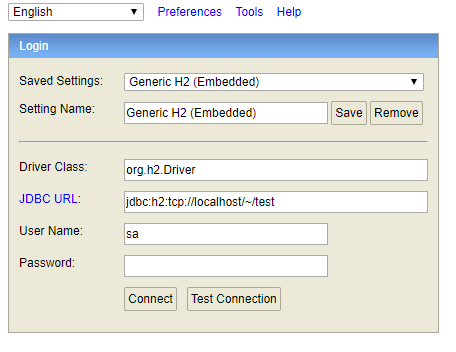

# Spring Security

```java
package com.todolist.todo;

import org.springframework.context.annotation.Configuration;
import org.springframework.security.config.annotation.authentication.builders.AuthenticationManagerBuilder;
import org.springframework.security.config.annotation.web.builders.HttpSecurity;
import org.springframework.security.config.annotation.web.builders.WebSecurity;
import org.springframework.security.config.annotation.web.configuration.EnableWebSecurity;
import org.springframework.security.config.annotation.web.configuration.WebSecurityConfigurerAdapter;

@Configuration
@EnableWebSecurity
public class springSecurityTest extends WebSecurityConfigurerAdapter {

    @Override
    protected void configure(AuthenticationManagerBuilder auth) throws Exception {
        super.configure(auth);
    }

    @Override
    public void configure(WebSecurity web) throws Exception {
//        super.configure(web);

        // ACL(Access Control List - 접근 제어 목록)의 예외 URL을 설정
        web.ignoring().antMatchers("/assets/**"); // 이미지 경로로 들어오는 경로
        web.ignoring().antMatchers("/favicon.ico"); // favicon.ico는 가능하게
    }

    @Override
    protected void configure(HttpSecurity http) throws Exception {
//        super.configure(http); // 모든 URL을 막고 있는 상황
        http.authorizeRequests()
                .antMatchers("/users/logout").authenticated()
                .antMatchers("/board/write", "/board/delete", "/board/modify").authenticated()
                .antMatchers("/admin/**").hasAuthority("ROLE_ADMIN")
                .anyRequest().permitAll();
    }
}

```


위와 같은 필터를 적용하여 Spring Security를 기본적으로 설정해주고 있습니다.

처음에는 localhost로 접근했을 때, 들어가자마자 계속 login으로 넘어갔었는데요. 위의 설정을 적용해주고 나니 이제 설정된 부분(authenticated된 부분)은 들어가지지 않고, 그 외의 것들은 잘 들어가집니다.


```java
package com.todolist.todo.controller;

import org.springframework.web.bind.annotation.RequestMapping;
import org.springframework.web.bind.annotation.RestController;

@RestController
public class MainController {

    @RequestMapping("/login")
    public String hello() {
        return "Hello World!";
    }

    @RequestMapping("/test")
    public String test() {
        return "It's test page";
    }

    @RequestMapping("/users/logout")
    public String logout() {
        return "logout";
    }
}

```


Whitelabel Error Page라고 뜨는게 정상인지는 잘 모르겠습니다. 저는 저 url로 접속하면 login 페이지가 다시 뜨게끔 바꾸어주고 싶습니다.


### http.csrf().disable();

그다음은 위 내용을 기입하였는데, CSRF가 뭔지 몰라서 찾아보니, Cross Site Request Forgery 공격을 스프링 시큐리티 측에서 차단하는 코드가 존재하는데, 이를 disable하는 것이 아닌가 싶습니다. (원래대로의 해결은 CORS를 위해, 접근 가능한 페이지를 상세하게 정리해야겠죠?)


### 로그인 설정 도중 에러 발생

```java
// 2. 로그인 설정
        http
                .formLogin()
                .loginPage("user/login") // 로그인 페이지 URL
                .loginProcessingUrl("/user/auth")
                .failureUrl("/user/login?result=fail")
                .defaultSuccessUrl("/", true)
                .usernameParameter("email") // 로그인 요청 시 id용 파라미터. email, id, name 등 무엇도 상관 없다고 한다.
                .passwordParameter("password");
```


`Error creating bean with name 'springSecurityFilterChain'` 이라는 이름의 에러 발생. 해결하기 위해 에러 이름 검색해보니 스택오버플로우에서 [해당 게시글](https://stackoverflow.com/questions/28616569/error-creating-bean-with-name-springsecurityfilterchain)을 발견함. 

- 시도1. getter와 setter가 모두 잘 들어있는지? : 잘 들어있었음.
- 시도 2. http.antMatchers("") 에서 에러가 발생할 수도 있다고 함. 왜냐하면 SpringSecurityFilterChanin은 패턴이 empty/null이면 에러를 발생시키기 때문임. -> 내 코드에는 그런 내용은 없었지만, SpringSecurityFilterChain이 문제인 듯 하여 꼼꼼하게 필터체인 부분들을 읽어보니 `/user/login`으로 적혔어야 하는 부분이 `user/login`으로 적혀있었음. 아무래도 그러면 존재할 수 없는 url이라 에러가 발생한듯? 고치니까 잘 돌아갔다.


### H2 데이터베이스 추가

H2를 추가해서 사용하려고 하니 Spring Security 공식 메뉴얼에서는 다음과 같은 Configruation을 수정해달라고 ㅎ나다.

1. Allow all access to the url path /console/*
2. Allow all requests to the root url
3. Disable CRSF
4. Disable X-Frame-Options in Spring Security


요렇게 해주면 된다고 한다.

그리고 `application.properties`에 다음과 같은 설정을 넣어줍니다.

```java
spring.h2.console.enabled=true
spring.h2.console.path=/h2-console
```

사실 h2-console이 디폴트라고 하기는 하는데, 전 이전에 읽은 공식문서에서는 console로 접속하라고 해서... 혹시 모르니 h2-console이라고 지정해주었니다. 이렇게 해주고 다시 프로젝트를 런해보면,



요렇게 딱 뜹니다. 연결 설정을 위해서는 [해당 게시글](https://galid1.tistory.com/611)을 참고했습니다.


네에 잘 나왔습니다.

DAO를 작성하려니 jpa를 gradle에 최초에 넣지 않은 것을 발견해 넣어줍니다. (넣어주신 후에는 꼭 refresh 해주셔야합니다.)


# 추가 공부

##### CSRF

- CSRF : Cross Site Request Forgery. 인터넷 사용자가 자신의 의지와는 무관하게 공격자가 의도한 행위(수정, 삭제 등록 등)를 특정 웹사이트에 request하게 만드는 공격
- 희생자의 권한을 도용하고 중요 기능을 실행하게 함. (ex. 페이스북 희생자의 계정으로 광고성 글 올리기)


##### CSRF에 대한 방어

1. Referrer 검증 : 백엔드 단에서 request이 referrer을 확인하여 도메인이 일치하는지 검증. (대부분을 방어할 수 있다.)
   - Referrer : A 사이트에서 링크를 클릭하여 B 사이트로 이동하는 경우, 웹브라우저는 B 사이트에 페이지에 대한 요청을 보내면서 HTTP 헤더에 A사이트의 URL을 같이 실어 보낸다. 이러한 URL을 Referrer이라고 부름. (뒤로 가기를 눌렀을 때 이전 사이트가 저장되는 원리인 것 같다.)
2. Security Token 사용 (CSRF Token) : 사용자 세션에 임의의 난수 값을 저장하고, 사용자의 요청마다 해당 난수 값을 포함시켜 전송함.
   1. Double Submit Cookie 검증 : Security Token의 한 종류로 세션을 사용할 수 없는 환경에서 사용. 웹 브라우저의 Same Origin 정책으로 인해 자바스크립트에서 타 도메인의 쿠키값을 확인/수정하지 못하는 것을 이요한 방어 기법이다. 서버단에서는 쿠키의 토큰 값과 파라미터의 토큰 값이 일치하는 지만 검사하면 됨.
      - Same-Origin Policy 동일 출처 정책 : 어떤 출처에서 불러온 문서나 스크립트가 다른 출처에서 가져온 리소스와 상호작용하는 것을 제한하는 보안 방식. 프로토콜, 호스트, 포트가 동일한 서버로만 ajax 요청을 주고 받을 수 있도록 하는 정책을 의미한다.
      - CORS(Cross-Origin Resource Sharing) : 추가 HTTP 헤더를 사용하여 브라우저가 한 출처에서 실행중인 웹 애플리케이션에 선택된 액세스 권한을 부여하도록 하는 매커니즘. 자체와 다른 출처(도메인, 프로토콜, 포트)를 가진 리소스를 요청할 때 cross-origin HTTP 요청을 실행함. (Same-Origin Policy의 문제점을 해결하기 위한 정책). **출처가 다른 도메인에서의 ajax요청이더라도 서버 단에서 데이터 접근 권한을 허용하는 정책**
      - CORS는 프로젝트를 하면서 한 번 겪었던 문제임. FE 서버 단과 BE 서버 단이 다르다보니 CORS가 발생하면서 FE에서 BE 서버에 요청을 보내지 못하는 일이 발생했었음. 이를 해결하기 위해 주먹구구 해결책을 사용하여 모든 도메인을 열어두었었다.. ㅎㅎ; 


# References

[Spring Security 기본](https://jungeunlee95.github.io/java/2019/07/17/2-Spring-Security/)

[Referrer이란?](https://m.blog.naver.com/PostView.nhn?blogId=dceye&logNo=50036211872&proxyReferer=https:%2F%2Fwww.google.com%2F)

[Spring Framework  & H2 Database 공식 메뉴얼](https://springframework.guru/using-the-h2-database-console-in-spring-boot-with-spring-security/)

[Spring Boot & H2](https://galid1.tistory.com/611)