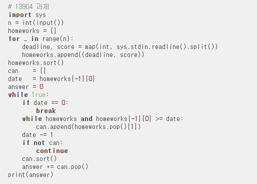

### 문제

한참을 고민한 [과제](https://www.acmicpc.net/problem/13904) 문제. 결국에는 다른 사람의 풀이를 검색해서 힌트를 보게 되었다.

- 힌트 : 백준 "회의실 배정" 문제

회의실 배정을 파이썬으로 풀어본 적이 없어, 파이썬에선 어떤 식으로 sort를 커스텀해주는 지 궁금해서 찾아보았더니 **튜플로 여러 인자를 주면 해당 인자의 순서대로 정렬을 해준다**고 한다. 가령 N행 2열의 배열 arr를 **arr[1]을 기준으로 정렬하고 값이 같으면 arr[0]을 기준으로 정렬** 하는 경우에는 다음과 같다.

```python
arr.sort(key = lambda x : (x[1], x[0]))
```

오.. 매우 신기하다. 그럼 마감일 순으로 거꾸로 그리디를 하는 회의실 배정을 기반으로 문제를 다시 도전해봅니다.


### 답

불필요하게 길게 푼 것 같지만... 어떻게 더 효율적으로 풀 수 있는지를 잘 모르겠다.

```python
# 하루에 한 과제를 끝낼 수 있는데,
# 과제마다 마감일이 있으므로 모든 과제를 못끝낼 수도 있음.
# 가장 점수를 많이 받을 수 있도록 과제를 수행하고 싶다.

# N : 과제의 개수
# d : 과제 마감일까지 남은 일수
# w : 과제의 점수

from collections import deque
import copy

def _13904() :
  ans = 0
  N = int(input())
  works = [[0]*2 for _ in range(N)]
  for i in range(N) :
    works[i][0], works[i][1] = map(int, input().split())
  
  works.sort(key = lambda x : (-x[0], -x[1]))
  works = deque(works) # popleft를 쓰기 위함 (deque의 popleft는 O(1)이다.)
  maxDay = (works[0])[0] # 최대 마감일

  while works :
    if maxDay <= 0 : break
    todayWork = [] # maxDay에 할 수 있는 작업 배열
    tempWorks = copy.deepcopy(works)
    
    for work in tempWorks :
      if work[0] >= maxDay :
        todayWork.append(works.popleft())
      else : break

    if todayWork :
      todayWork.sort(key = lambda x : (-x[1]))
      todayWork = deque(todayWork)
      ans += (todayWork.popleft())[1]
      works = list(works) + list(todayWork)
    
    works = list(works)
    works.sort(key = lambda x : (-x[0], -x[1]))
    works = deque(works)
    maxDay -= 1

  return ans


print(_13904())
```




[이 블로그](https://chinpa.tistory.com/34) 에서 풀이를 보니 짧고 예쁘게 풀려있습니다.

하나하나 살펴보면, 딱히 deque로 선언하지 않고 sort를 해주었네요. 애초에 튜플로 넣어주고 deque로 하는 대신 내림차순 그대로 뒤에서부터 꺼냈네요...! 또르르

homeworks이 남아있고, homeworks의 맨 끝이 date보다 크면 계속 꺼내줍니다. 알고리즘 자체는 유사한데 저처럼 불필요한 과정을 안거친다는 점에서 훨씬 속도가 잘나올 것 같습니다.


