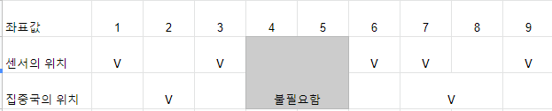

### 문제

[2212 센서](https://www.acmicpc.net/problem/2212) 문제입니다.

고속도로 위에 N개의 센서가 있으며, 최대 K개의 집중국을 세울 수 있습니다. 이때 

각 집중국의 수신 가능 영역의 길이의 합 최소화하는 것이 목적입니다.


Ex1)

1 3 6 6 7 9 좌표값에 센서가 위치해있습니다.

각 인접한 센서 간의 거리를 구하면, 다음과 같습니다.

2 3 0 1 2

송신국을 2개 세운다면, 위의 센서 거리를 반으로 뚝 자르면 됩니다. 수신 가능 영역의 길이의 합을 최소화해야하므로, 인접거리가 가장 긴 3을 제거을 제거해주면 됩니다. 이런식으로 K-1개의 인접거리를 제거해주면 됩니다.

2 / 0 1 2 이렇게 끊어서 집중국을 배치하는 시스템입니다. 제거한 인접거리 이외의 나머지 거리를 모두 더해주면 됩니다. ( 2 + 0 + 1 + 2 = 5 ) 사실상 집중국에 의해 끊어져 있으므로, (2 + 3 = 5) 으로 이해하는 편이 더 좋겠습니다.

배치로 생각해보자면,



위와 같은 모습으로 생각해볼 수 있겠습니다. (1~3) 을 아우르는 좌표 2쯤에 집중국이 위치해있고, 6~9를 아우르는 대략 뭐.. 7.5쯤에 집중국이 위치해있다고 생각하면 됩니다.


### 답 코드

```python
def _2212() :
  N = int(input())
  K = int(input())
  sensors = list(map(int, input().split()))
  
  # sensors 오름차순 정렬
  sensors.sort()

  # 인접거리 구하기
  dist = [0]*(N-1)
  for i in range(0, len(sensors)-1) :
    dist[i] = sensors[i+1]-sensors[i]

  # 인접거리 내림차순 정렬
  dist.sort(reverse=True)
  ans = 0
  for i in range(K-1, len(dist)) :
    ans += dist[i]
  
  return ans
  # (0,K-1]까지는 무시하고, (K-1,)까지 sum 구한다

print(_2212())
```

