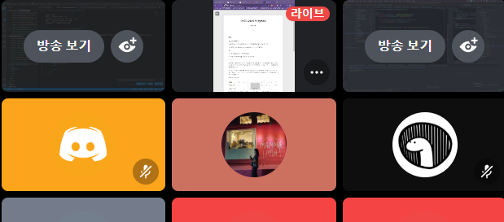
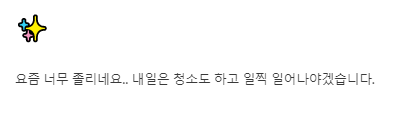

# TIL

# 🎉

### 문제풀이

- 알고리즘 활용 스터디 공통문제 풀고 업로드
- 백준 13904 풀고 풀이 업로드 [링크](https://joomal.github.io//210416cp1/)
- 백준 2212 풀고 풀이 업로드 [링크](https://joomal.github.io//210416cp2/)

- 앞으로는 골드 문제만 풀 생각입니다... 제발 정신차려~!~!

### 월코페

어제 참여했던 프로그래머스 월코페의 [답지](https://prgms.tistory.com/47)가 나왔습니다. 다시 풀어봐야겠네요. 풀다가 막혔던 3번 문제 경우에는 시간초과가 나왔었는데, 풀이를 읽어보아도 제 풀이가 맞았던 것 같은데.. 아마 알고리즘은 맞았어도 구현의 차원에서 문제가 있었나봅니다.

시간이 없어서 보지도 못했던 4번 문제 경우에는 BFS+DP 문제라고 하네요. 4번 문제만 풀이가 한 바닥이고 나머지는 뭐... 이렇게 쬐끔 알려줄 거면 왜 대회 열었는지..? 그래도 3번 문제 질이 좋았으니 용서하기로 했습니다..

(3번같은 경우에는 비슷한 문제가 라인이었나..? 암튼 질 좋은 문제를 내주는 코테에서 한 번 봤었던 리프노드부터 탐색하는 트리 문제였고요.. 그 때 못풀었었는데 이번에는 반타작은 해서 넘 기뻤습니다.)

### Spring Security

- Spring Security를 공부해보고 있습니다. 목표는 H2 + Spring Security로 회원가입+로그인+로그아웃 구현해보는 거! 뷰는 뭐.. 그냥 엉망으로 만들거나 안만들 예정입니다. 면접 공부도 해야하고 코딩테스트 준비도 해야하고... 엉망이네요... 

### 모각코 참여

강제 집중을 위해 라이브를 켜두고 공부했습니다.

# ✨

- 청소 : 오랜만에 대청소 했습니다. 빨래도 돌려서 널어야하는데 세상에서 젤 귀찮네요.

어제 TIL에 올린 목표를 이뤘네요. 일찍 일어난건 자의는 아니었고, 옆 건물 철거를 한다고 건물을 터뜨리고 있어서 엄청난 진동에 자연스럽게 일어나졌습니다. 깨서 의자에 앉아있는데도 땅이 울리더라구요. 양해를 구하신 상황이라 뭐 기분이 안좋거나 하진 않았고, 철거 작업이 이렇게 진동이 옆집/옆옆집까지 올 정도로 클 줄은 몰랐어서 매우 신기했습니다....

