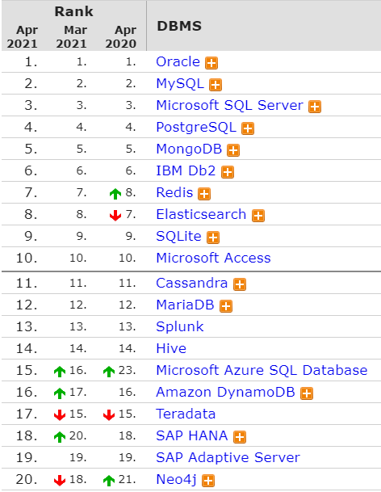

# 첫 회의

기본 스택에 대한 이야기를 나누셨다. 회의 과정에서 긴가민가하는 단어들과 스택들을 받아적어 공부해보기로 했다.

# 단어

### 이점

- 어떠어떠한 스택을 사용했을 때의 **이점**이 무엇인지에 대해 꼭 물어보셨다. 통상 사용하는 어떠한 스택이 아니라 해당 스택을 사용할 경우에 얻을 수 있는 장점인데, 구체적으로는 **이전 스택의 이러한 단점**을 해당 스택으로 **어떻게** 보완할 수 있는지를 설명해야 한다.

### 마이그레이션

- 데이터를 한 형식에서 다른 형식으로 **이전**하는 것을 의미한다. 가령 오늘날은 온프레미스 인프라에서 클라우드 기반 스토리지로 옮기는데, 이때 옮기는 플랫폼에 맞추어 데이터를 최적화하거나 전환하는 것을 마이그레이션이라고 한다.

1. 스토리지 마이그레이션 : 기존 어레이에서 최신 어레이로 데이터를 이동하여, 다른 시스템이 데이터에 엑세스할 수 있게 하는 프로세스.
2. 클라우드 마이그레이션 : 온프레미스 데이터센터에서 클라우드로 or 클라우드에서 다른 클라우드로 이전하는 것.
3. 애플리케이션 마이그레이션 : 애플리케이션을 한 환경에서 다른 환경으로 이동하는 프로세스를 의미한다.

- 서비스중인 한 어플리케이션 또는 모듈 등을 전혀 다른 환경(OS, 미들웨어, 하드웨어 등)에서도 돌아갈 수 있도록 전환하는 것을 의미한다. 가령 C로 개발된 Solaris OS 기반 프로그램을 리눅스 기반 시스템으로 옮긴다면, Solaris OS에서 참조하던 라이브러리, API 등에 대해 동일한 역할을 하는 리눅스의 그것으로 1:1 변환/매핑하는 작업이 필요하다.
- 보통은 데이터 마이그레이션을 의미하는 것 같다.

# 데이터베이스

### NoSQL

- SQL만을 사용하지 않는 DBMS를 지칭하는 단어이다. 리스트, 해시 테이블, 트리, 그래프 등의 다양한 방법으로 데이터를 관리하는 DBMS를 의미함. (NO!! SQL이 아니라 Not only SQL이다.)
- 최근 현업에서는 NoSQL을 도입해보는? 추세인 것 같다.
  - RDBMS가 클러스터 상에서 효율적으로 동작하도록 설계되지 않았기 때문이다.
- 스키마 없이 동작한다. 따라서 데이터 구조를 미리 정의할 필요가 없으며, 시간이 지나더라도 언제든지 바꿀 수 있기 때문에 비형식적인 데이터를 저장하는 데 용이하다. 데이터타입에 따른 암묵적인 스키마는 여전히 존재함. (필드의 이름 등)
- Key-value, Document, Column-family, Graph 모델로 나눌 수 있는데, Graph 모델을 제외한 나머지 세 모델은 **집합-지향(Aggregate-oriented)** 모델이다.
  - 집합Aggregate : 연산의 한 단위로 취급되는 연관된 객체들의 집합. 여러 대의 클러스터로 이루어진 시스템에서 사용하기 적합하다.
  - Join 연산이 불가능하다. 이를 보완하기 위해 몽고DB, 카산드라 등의 데이터베이스에서는 **맵 리듀스**를 지원한다. (Hadoop에 비하면 속도도 매우 느림)

1. Key-value : 가장 단순한 형태의 NoSQL. 값의 내용을 사용한 쿼리가 불가능하다는 단점이 있다. 키를 사용해 값을 읽어들인 뒤, 어플리케이션 레벨에서 적절히 처리해주어야 함. (ex. Memcached, Riak, Redis, Amazon Dynamo DB, LevelDB 등)
2. Document : 데이터는 key와 도큐먼트의 형태로 저장된다. 객체지향에서의 객체와 유사하며, 하나의 단위로 취급되어 저장된다. 하나의 객체를 굳이 여러 개의 테이블에 나눠 저장할 필요가 없어진다. 도큐먼트 내의 item을 이용한 쿼리가 가능한데, 이를 위해서는 Xqeury같은 도큐먼트 질의 언어가 필요하다. 질의의 결과가 json, xml 형태로 출력된다. 질의 언어도 SQL과는 매우 다름. (ex. MongoDB, CouchDB, MarkLogic)
3. Column-family : 키에서 필드를 결정한다. 키는 Row(키 값), Column-famly, Column-name을 가진다. 연관된 데이터들은 같은 Column-family 안에 속해있으며, 각자의 Column-name을 가진다. 데이터 하나가 하나의 커다란 테이블로 표현이 가능한 느낌인 것 같다. key - 필드, 요런 식으로.. 값들도 바이너리 데이터로 존재해서 어떤 형태라도 저장될 수 있음. 클러스터링이 쉽다. 뭐.. 클러스터 인덱스가 애초에 key로 존재하는 느낌이니까 그런듯? (ex. HBase, 카산드라, Hypertable)
4. Graph : 집합 지향 모델보다는 관계형 모델에 가깝다. 데이터는 연속적인 노드, 관계, 특성의 형태, 그러니까 그래프 형태로 저장된다. 질의는 그래프 순회를 통해 이루어진다. **관계**가 중요한 경우에 중요하다. 내 친구의 친구를 찾는 질의 등에 적합하고, 연관된 데이터를 추천해주는 추천 엔진이나, 패턴 인식을 위한 데이터베이스로도 적합하다. 클러스터링에 적합하진 않다.

### MongoDB

- NoSQL
- key-value pair로 데이터 구조가 이루어져있다. 
- 각 객체의 구조가 뚜렷하고 복잡한 JOIN이 없음.

### PostgreSQL

- 포스트그레스-에스큐엘 이라고 주로 읽는다.

- ORDBMS(객체-관계형 데이터베이스 관리 시스템)이다.
- Ingres를 기반으로 한다고 한다. 
- 업데이트시에 insert하는 식으로 되어서 업데이트에 불리하다. (지우고 새로 추가하는 식)

### MariaDB

### SQLite

### ACID

- Atomicity, Consistency, Isolation, Durability

# 백엔드

### Spring ORM

# 파일 저장

### S3

### DB에 다 때려박기

# References

[PostgreSQL vs MongoDB](https://bitnine.tistory.com/48)