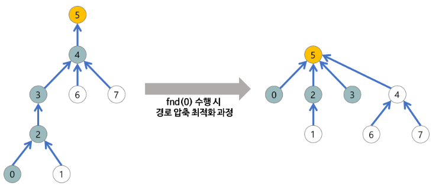

# Union-Find

크루스칼을 알기 위해서는 Union-Find를 먼저 알아야합니다.

### Disjoint Set

- 서로소 집합

### Union-Find

- 서로소 집합을 표현할 때 쓰는 알고리즘.
- 다양한 자료구조를 통해 만들 수 있으나 트리구조가 가장 효율적이다.

### Union-Find의 연산

1. make-set(x) : x를 유일한 원소로 하는 새로운 집합을 만든다. [x] <- 이런 식
2. union(x,y) : x가 속한 집합 + y가 속한 집합. 
3. find(x) : x가 속한 집합의 루트 노드값(대표값)을 반환한다. 루트 노드는 x가 어떤 집합에 속해있는 지를 대표할 수 있다.

### Union-Find의 과정

1. 초기화
   - P[i] = i인 상황.
   - P = [1,2,3,4,5]
2. union(1,2)
   - find(1)=1, find(2)=2 => p[2] = 1 (임의로 2를 1로 넣어줌. 둘 중 어떤 값을 해줘도 상관없음. 다만 일관성을 위해 작은 값을 무조건 대표값으로 하기로 하자.)
   - P = [1,1,3,4,5]
3. union(4,5)
   - find(4)=4, find(5)=5 => p[5]=4
   - P = [1,1,3,4,4]

4. union(1,4)
   - find(1)=1, find(4)=4 => p[4]=1
   - P = [1,1,3,1,4]

이런 식으로 계속 union을 해주고, union에서 루트노드를 찾기 위한 방법으로 find를 사용하게 된다.

위를 보면 결국 한 집합에는 겹치는 애들이 없게 된다.

- 인덱스 1을 대표로 갖는 값들 집합 : 1,2,4

- 인덱스 3을 대표로 갖는 값들 집합 : 3

- 인덱스 4를 대표로 갖는 값들 집합 : 5

이런 식으로 각 집합을 모두 더하면 결국 {1,2,3,4,5}가 되고 각 집합 간에는 중복되는 노드가 없다. 즉 서로가 상호배타적인 집합이다.

### 기본 구현

```python
p = []
for i in range(N+1) :
    p.append(i)

def find(u) :
    if u != p[u] :
        p[u] = find(p[u]) # 경로 압축
    return p[u]

def union(u, v) :
    root1 = find(u)
    root2 = find(v)
    p[root2] = root1
```

### 최적화

트리가 완전 비대칭인 경우에는 말단 노드에서부터 루트 노드까지 N개의 노드를 전부 거치면서 가야한다. find는 O(N)이 되고, 이에 따라 union도 O(N)이 된다.

최적화가 안된 방식으로 find를 작성하면?

```python
def find(u) :
    if p[u] == u : return u # 부모 노드는 자신의 노드 번호를 갖고 있으므로
    else :
        return find(p[u]) # 하나하나 찾아서 올라간다.
```

위의 형태가 된다. 그렇다면 경로 압축이 된 형태 부분을 주석과 함께 살펴보면 다음과 같다.



```python
def find(u) :
    if u != p[u] : # 부모 노드가 아니라면
        p[u] = find(p[u]) # 부모 노드를 찾아서 업데이트 해준다.
    return p[u] # 부모 노드를 반환한다.
```

결국 find를 시행할 때, 이왕 하나하나 찾아서 올라가고 있으니까 그 부모노드 값으로 아예 업데이트를 해주어서 경로를 압축해버리는 것이다.


# 크루스칼Kruskal

프로그래머스의 [섬 연결하기](https://programmers.co.kr/learn/courses/30/lessons/42861)가 크루스칼 알고리즘을 활용해야 하는 문제입니다.

### 언제 쓰나요?

- 최소신장트리(MST; 무방향 가중치 그래프에서 간선의 가중치 합이 최소인 것)을 찾는 알고리즘입니다. 

1. 사이클을 이루지 않는
2. 최소 비용 간선 집합을 구하고 싶을 때.

### 어떻게 쓰나요?

모든 선택에 있어 가중치가 최소인 선택을 하되, 사이클을 만들지 않는 노드를 선택합니다. (그렇기 때문에 섬 연결하기 문제가 그리디 문제로 분류되어 있습니다.)

1. 그래프의 간선들을 가중치의 오름차순으로 정렬
2. 사이클을 형성하지 않는 간선을 선택
   - 사이클 형성 여부 판별 : union-find를 사용하여, 해당 간선을 선택하면 사이클이 생기는지 판별합니다. 가령 n1, n2를 선택하려 할 때, n1의 부모 노드 == n2의 부모 노드 라면 사이클이 생기게 되겠죠?
   - 가장 가중치가 작은 간선을 먼저 뽑아내기 위해 heapq를 사용합니다.
3. 해당 간선을 MST 집합에 추가합니다.

### 정당성 증명

일반적인 그리디와 같은 형태로 최소신장트리임을 증명할 수 있습니다.

- 그리디 알고리즘의 증명
  1. **greedy choice property** : 탐욕적인 선택으로 인해 최소한 손해를 보진 않는다.
  2. **optimal substructure** : 항상 최적의 선택만을 내려도 전체 문제의 최적해를 얻을 수 있다.

##### 신장트리 증명

- union-find를 통해 루트 노드가 겹치지 않는 노드만을 선택했으므로 신장트리임은 자명하다.

##### greedy choice property 증명


# References

[Union-Find](https://gmlwjd9405.github.io/2018/08/31/algorithm-union-find.html)