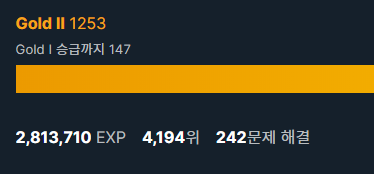

# TIL

# 🎉

### 스킬체크 leve 3 - 1차 시도

- 프로그래머스 [정수 삼각형](https://programmers.co.kr/learn/courses/30/lessons/43105) 풀고 풀이를 올렸습니다.
  - 스킬 체크에서 만난 거라 정답 알고리즘을 모르고 BFS로 접근했는데, 시간초과를 받았었습니다. 음... 열심히 하면 더 실력이 늘겠죠 뭐!
  - 완전 탐색으로 풀린다는 점에서 DP라는 것을 눈치챘어야 했는데, 그러지 못해서 아쉬웠습니다.

### 스킬체크 leve 3 - 2차 시도

- [이중우선순위큐](https://programmers.co.kr/learn/courses/30/lessons/42628) 풀었습니다. 하나 짜리 heapq로 풀었더니 바로 풀리긴 했습니다. 아마 파이썬말고 다른 언어로 할 때 어려움을 겪으시는 듯...?
- [블록 이동하기](https://programmers.co.kr/learn/courses/30/lessons/60063) 문제를 풀다가 10점 맞고 실패했습니다 ㅎㅎ.. 넘 속상하네요. 

### 문제풀이

- [프로그래머스 비밀지도](https://joomal.github.io//210423cp02/) 풀이입니다.
- [프로그래머스 다트게임](https://joomal.github.io//210423cp03/) 풀이입니다.

# ✨

소박한 자랑거리!! Gold2로 승급했습니다 ✌ 

플래가는 게 목표였는데 골드를 너무 못풀어서 반 년은 있어야 플래 갈 것 같네요.. 그래도 발전이 있는 것 같아 안심이 됩니다!! 얼른 공채 뚫을 실력이 되고 싶어요!