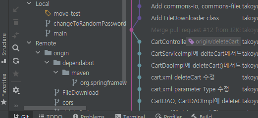
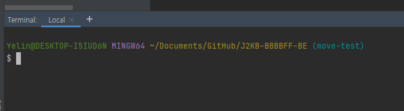
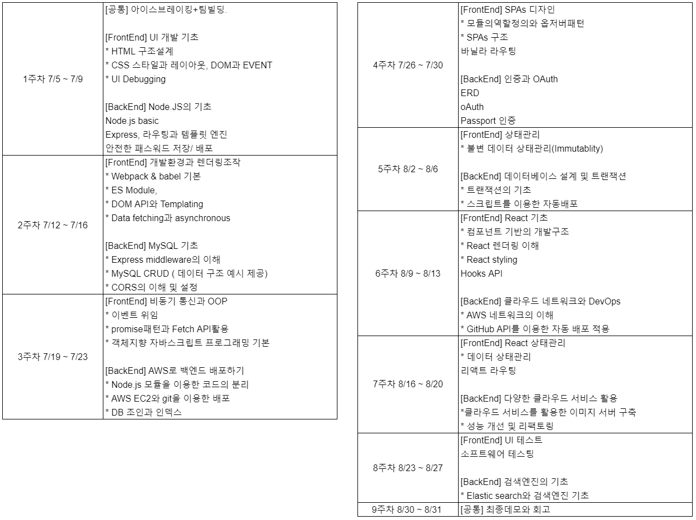

# 🎉

### 객체지향의 사실과 오해

- 다 읽었습니다. 한 번 빠르게 다시 훑으면서 정리해야겠습니다.

### 기술 삽질 : 이전 프로젝트를 인텔리제이로 열기

- IntelliJ에서 이클립스 프로젝트 불러오기
  - eclipse에서 maven을 사용하지 않았다면 독자적인 이클립스 빌드 시스템을 사용하게 된다. 이 경우에는 `Open as eclipse project`로 진행하면 되고, 내 경우에는 maven을 사용했기 때문에 `Open as Maven project`로 진행하면 된다.

- 신기하게도 git log가 뜬다. 진작 인텔리제이로 옮겨서 시도해볼걸 싶다.

- 최근 새로 배운, IntelliJ에 깃 터미널 띄우기! Settings > Tools > Terminal 에서 `Shell path : "C\Program Files\Git\bin\sh.exe" -login -i`로 해두면 된다.

# ✨

### 삽질

- 카카오 인턴 자소서가 내일까지라는 알람을 받고 놀라서 앉았는데

### J2KB 전체회의

- 전체회의 참여 후 잠시 추가 미팅 있었습니다.

---

### 우아한테크캠프 4기 커리큘럼

우선 위의 테크캠프를 신청해보겠지만, 해당 커리큘럼 자체도 매우 좋아 보여 추후에 혼자 공부해보고자 합니다.

### 백엔드 기초

- 라우팅과 템플릿 엔진
- 안전한 패스워드 저장, 배포

### MySQL

- Express Middleware
- MySQL CRUD
- CORS의 이해 및 설정

### AWS로 백엔드 배포하기

- AWS EC2와 git을 이용한 배포
- DB 조인과 인덱스

### 인증과 OAuth

- ERD, oAuth, Passport 인증

### 트랜잭션

- 트랜잭션
- 스크립트를 이용한 자동배포

### 클라우드 네트워크와 DevOps

- AWS 네트워크
- GitHub API를 이용한 자동 배포 적용

### 다양한 클라우드 서비스

- 클라우드 서비스를 활용한 이미지 서버

### 검색엔진

- Elastic Search

