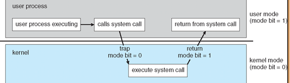
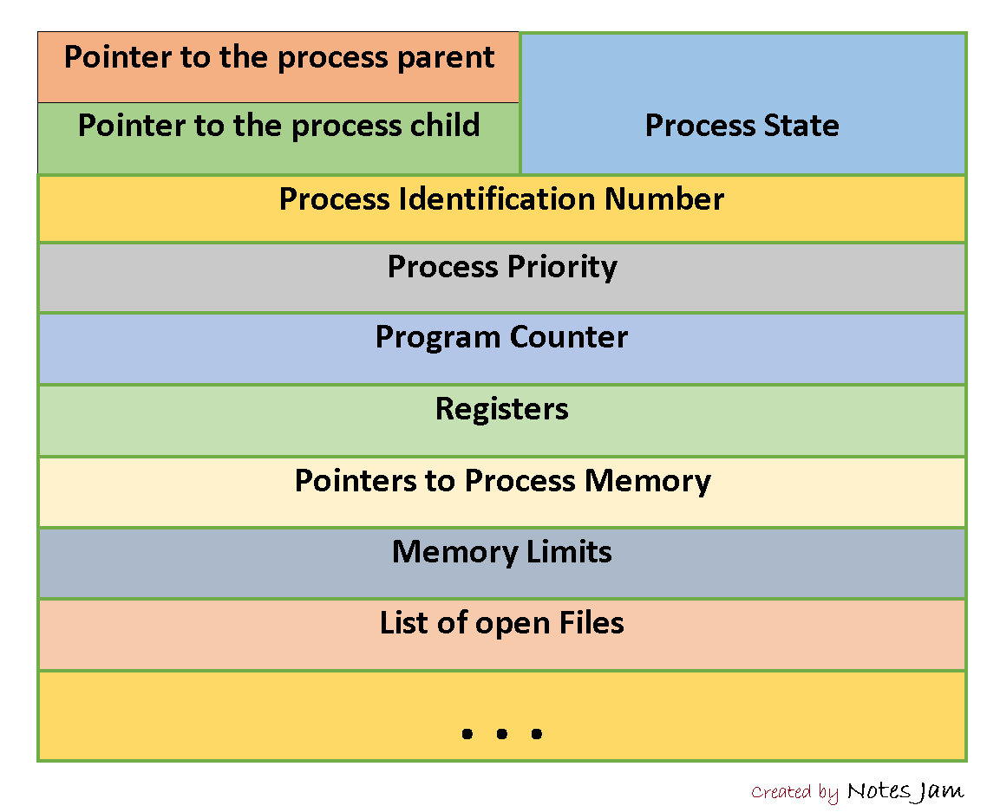
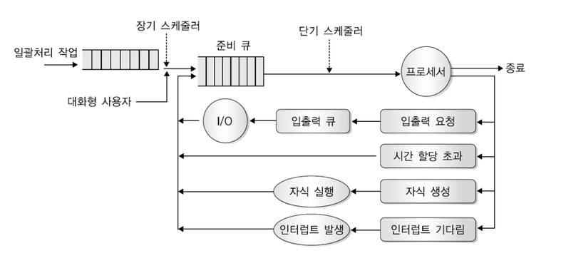

[TOC]

# 컴퓨터 구조와 원리

### 폰 노이만 구조

1. 메모리에서
2. 명령을 인출해서
3. 명령 레지스터에 담고,
4. 명령을 해독하여,
5. 피연산자를 인출하고,
6. 이를 내부 레지스터에 저장한다.

### 컴퓨터 시스템의 구성

- 부트스트랩(=펌웨어)
  - ROM, EEPROM(Electrically Erasable Programmable ROM) 등의 읽기 전용 메모리에서 **OS의 커널을 찾아** 메모리에 적재한다.
  - Interrupt
    - HW : System bus -> 인터럽트 서비스 루틴 실행
    - SW : syscall
- I/O 구조 : 인터럽트 이용하여 디바이스 드라이버에 통보, 입력 완료되면 데이터 또는 데이터포인터를 반환한다.

### 컴퓨터 시스템 구조

1. 단일 처리기 시스템(Single Processor Systems)
2. 다중 처리기 시스템(Multi-processor Systems) = 병렬 시스템 = 멀티코어시스템
   - 장점 : (1) 처리량 증가 (2) 비용 절약 (여러 대의 컴퓨터와 달리 여러 개의 처리기는 주변 장치 등을 공유한다) (3) 장애 대응 (1개 고장난다고해서 멈추지 않음)
   - 태스크 처리 방식
     1. 비대칭적 다중 처리 : 주 처리기가 작업 스케쥴 후 분배
     2. 대칭적 다중 처리(SMP;Symmetric Multiprocessing) -> 대부분 이거

### 운영체제 연산

연산모드

- 사용자모드 (mode bit = 1)
- 커널모드 (mode bit = 0)

# 프로세스 관리

### 프로그램과 프로세스

- 프로그램 : 명령어 집합

-> 프로그램의 실행파일을 메모리에 적재

- 프로세스 : PC(Program Counter) 등을 지니는 능동적인 개념

### 운영체제가 제공하는 메모리의 구조

- 스택 : 매개변수, 복귀주소, 로컬변수 등 임시적인 자료가 들어간다. 컴파일 타임에 크기가 결정된다.
- 힙 : 사용자의 동적할당변수가 들어간다. 런타임에 크기가 결정된다.

##### 왜 스택은 큰 주소에서부터 낮은 주소 값으로 할당될까?

- 스택 영역 뒤에 커널 영역이 있음. 스택 영역이 초과되는 크기를 저장한 후 커널 영역에 침범하는 **버퍼오버플로우** 방지하기 위함.

##### 힙 영역으로 스택 영역이 넘어가거나, 힙 영역이 스택 영역으로 넘어가면 어떻게 될까?

- overflow 발생. 이를 방지하기 위해 시스템 차원에서 힙 영역, 스택 영역을 넘어가는 지점을 레지스터든가에 받아두고, 다음 데이터 할당이 영역을 넘어가면 overflow를 발생시키는 것으로 알고있습니다.

### 프로세스 전이맵(Process State Diagram)

### PCB (Process Control Block)

- Process State : new, ready, running, waiting, halted 등이 담겨있습니다.
- Program Counter : 다음에 실행할 명령어의 주소
- 레지스터 : CPU 레지스터들
- Memory Limits : 넘으면 인터럽트 발생!
- list of open files : 할당된 i/o 장치들 등등이 있습니다.
- 그외 : CPU-스케줄링 정보, 메모리 관리정보(base register, limit register, page table, segment table 등), 각 스레드 정보 등

##### 프로세스가 바뀔 때 PCB도 같이 바뀌는 과정

1. p0의 system call 호출 혹은 인터럽트
2. pcb0에 p0의 상태 저장
3. pcb1로부터 p1의 상태 적재
4. p1 실행
5. p1의 system call 호출 혹은 인터럽트
6. pcb1에 p1의 상태 저장
7. pcb0으로부터 p0의 상태 적재

### 프로세스 스케쥴링

시분할 : 사용자 상호작용이 가능하도록 CPU가 여러 프로세스를 빈번하게 교체한다.

Job Queue로 스케쥴링 함.

- 링크드리스트 형태
- 주 메모리에 Job Queue가 들어가있음

### 큐잉 도표

### 스케쥴러의 종류

1. 장기스케쥴러(Job Scheduler) : 대용량 메모리(디스크)에서 꺼내서 레디 큐에 넣어준다.

   