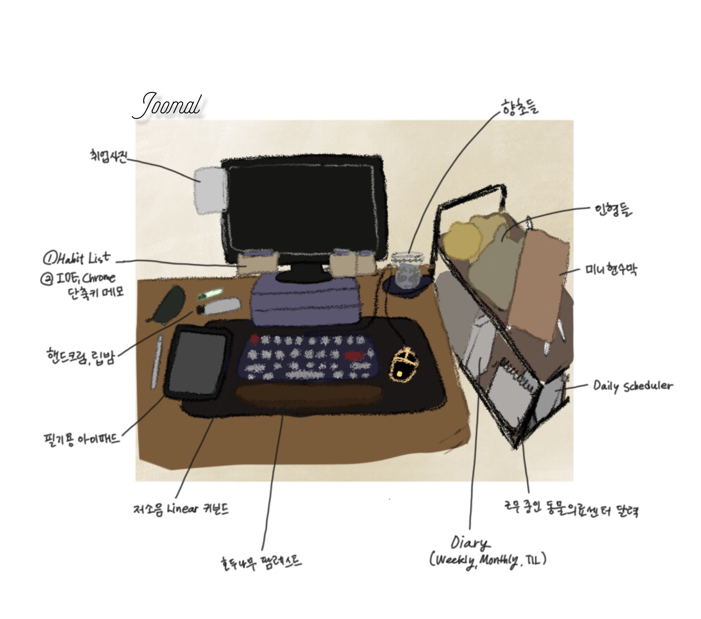

# 𝑨𝒃𝒐𝒖𝒕 𝒎𝒆

<iframe width="600" height="450" src="https://joomal.github.io/AboutMeCMD/index.html" frameborder="0" scrolling="no" align="center"> 
 브라우저가 iframe 요소를 지원하지 않습니다. 
</iframe>

웹/앱 백엔드 개발자를 목표로 성장하고 있으며, 최근에는 Spring을 공부하고 있습니다. 공부한 내용은 [withBackendRoadmap 레파지토리](https://github.com/JooMal/withBackendRoadmap)에 정리하고 있습니다. **좋은 것을 더 좋게** 만드는 데에 관심이 많습니다. 일상적으로는 Daily 스케쥴러와 Weekly+Monthly 스케쥴러를 두개 사용하며 하루를 보다 효율적으로 만들며, 기술적으로는 `클린코드`를 기반으로 한 리팩토링에 힘쓰고 있습니다.  
 
[TIL](https://joomal.github.io/categories/til/)을 2020년 11월부터 꾸준히 작성하고 있습니다. 최근에는 상단에 위치한 [AboutMeCmd](https://github.com/JooMal/AboutMeCMD)를 개발하는 사이드 프로젝트를 진행했으며, 현재는 `J2KB` 코딩 스터디에서 쇼핑몰 제작 프로젝트를 진행하고 있습니다.

# 𝑯𝒊𝒔𝒕𝒐𝒓𝒚

철학 주전공생으로, 2017년 [김영건 교수님](https://blog.naver.com/sellars)의 분석철학을 시작으로 논리학에 몰두했습니다. 얼마 지나지 않아, 논리 기호를 기반으로 이루어진 학문이 있다는 소문을 듣고 그렇게 컴퓨터공학을 복수전공하게 되었습니다.  

# 𝙒𝙤𝙧𝙠𝙨𝙥𝙖𝙘𝙚

높은 집중도 유지를 위해 정돈된 공부 환경, 근무 환경을 중요시합니다. 2020년 말부터 텐키리스 키보드와 팜레스트에 정착했습니다.  
